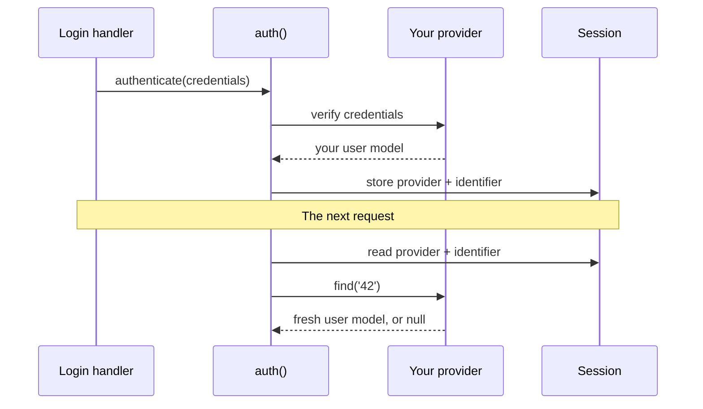

# Authentication and permissions

`naf/auth` verifies credentials and checks roles, permissions and per-object policies. Your
application supplies the identity model and account source. Built-in providers support ORM
and PDO accounts; custom providers implement the same contract.

For a working browser login, follow the quickstart and [login form](recipes/login-form.md).
Session persistence requires `naf/session`; the core Auth package does not install a user
schema or account registration flow.

## Responsibilities { #what-this-plugin-is }

Auth separates authentication and authorization:

1. **Who is this?** — verify credentials, remember the person across requests.
2. **What may they do?** — permissions, roles, and rules that depend on the object at hand.

A provider verifies credentials and reloads accounts from their source. Built-in providers
support `naf/orm` and PDO; other backends implement `ProviderInterface`. Account schemas and
account lifecycle remain application responsibilities.

### Main services { #the-whole-picture }



You own the provider and the user model. The session stores never more than the provider
name and the identifier, for example `['provider' => 'database', 'identifier' => '42']`.
Permission checks then ask the freshly loaded model for its roles and permissions.

The integration has these responsibilities:

| Part | Who writes it | What it is |
| --- | --- | --- |
| **User model** | you | Any class of yours that implements `IdentityInterface`. `auth()->user()` hands it straight back. |
| **Provider** | you, `OrmProvider`, or `DatabaseProvider` | Knows where accounts live: verify credentials, reload an account by identifier. |
| **`auth()`** | this plugin | The one object you call. Signs people in and out and answers every permission question. |
| **Store** | this plugin | Writes those two values into the `naf/session` session. Nothing else is persisted. |

With session persistence, restoration reloads the identity through its provider on a new
request. A missing or inactive account loses its login. Changed grants are obtained from the
reloaded identity; demotion does not itself turn an otherwise active account into a guest.

---

## Quickstart

This example starts from [Your first application](first-app.md) and uses SQLite, so no
separate database server is needed. Install the ORM and session integration explicitly.
The example uses `naf/database` 0.2.4+, which `naf/orm` installs:

```bash
composer require naf/auth naf/orm naf/session
mkdir -p app/Models bin storage
```

PHP needs `pdo_sqlite`. Each titled block below is a complete file. If you already configured
other features, merge the `database` and `auth` keys into your config and retain other service
bindings before `app()->run()`.

### 1. Configure the connection and model

```php title="app/config.php"
<?php

use App\Models\User;

return [
    'database' => [
        'driver' => 'sqlite',
        'database' => BASE_PATH . '/storage/app.sqlite',
    ],
    'auth' => [
        'users' => ['model' => User::class],
    ],
];
```

```php title="bootstrap.php"
<?php

define('BASE_PATH', __DIR__);
require __DIR__ . '/vendor/autoload.php';

use function Naf\app;

app()->run();
```

`naf/database` 0.2.4+ registers the configured connection under `PDO::class`, which the
auth model factory uses. If an existing application locks an older version, update that
dependency before using this bootstrap file.

### 2. Define your user model

```php title="app/Models/User.php"
<?php

namespace App\Models;

use Naf\Auth\Identity\{UserInterface, UserProfile};
use Naf\ORM\Model\AbstractModel;

final class User extends AbstractModel implements UserInterface
{
    protected string $username = '';
    protected string $password = '';
    protected string $roles = '';
    protected int $suspended = 0;
    protected string $name = '';
    protected string $email = '';
    protected int $email_verified = 0;

    public function getIdentifier(): string { return (string) $this->id; }
    public function getRoles(): iterable
    {
        return $this->roles === '' ? [] : explode(',', $this->roles);
    }
    public function getPermissions(): iterable { return []; }
    public function isActive(): bool { return $this->suspended === 0; }
    public function getProfile(): UserProfile
    {
        return new UserProfile($this->name, $this->email, $this->email_verified === 1);
    }
    public function getUsername(): string { return $this->username; }
    public function getPassword(): string { return $this->password; }
    public function setPassword(string $password): void { $this->password = $password; }
}
```

`UserInterface` extends `IdentityInterface`. `isActive()` rejects suspended accounts both at
login and on restoration. `getProfile()` deliberately selects the fields an OAuth consent
screen or UserInfo response may expose.

### 3. Create a local test account

This CLI script creates the matching table and inserts a **local demo account** once. It
preserves an existing account on reruns. Do not seed these public credentials on a deployed
site; account creation there must hash the user's own password.

```php title="bin/seed-demo.php"
<?php

if (PHP_SAPI !== 'cli') {
    http_response_code(404);
    exit;
}

require dirname(__DIR__) . '/bootstrap.php';

use function Naf\Database\database;

$pdo = database();
$pdo->exec('CREATE TABLE IF NOT EXISTS users (
    id INTEGER PRIMARY KEY AUTOINCREMENT,
    username TEXT NOT NULL UNIQUE,
    password TEXT NOT NULL,
    roles TEXT NOT NULL DEFAULT \'\',
    suspended INTEGER NOT NULL DEFAULT 0,
    name TEXT NOT NULL DEFAULT \'\',
    email TEXT NOT NULL DEFAULT \'\',
    email_verified INTEGER NOT NULL DEFAULT 0
)');
$stmt = $pdo->prepare('INSERT INTO users (username, password, roles, name, email)
    VALUES (:username, :password, :roles, :name, :email)
    ON CONFLICT(username) DO NOTHING');
$stmt->execute([
    'username' => 'demo',
    'password' => password_hash('local-demo-password', PASSWORD_DEFAULT),
    'roles' => 'member',
    'name' => 'Demo User',
    'email' => 'demo@example.com',
]);
echo "Demo account ready.\n";
```

```bash
composer dump-autoload
php bin/seed-demo.php
```

Expect `Demo account ready.`. Continue with [A login form](recipes/login-form.md) to sign in
as **demo** with **local-demo-password**, view a protected page and sign out.

The source name is **`users`** when only `auth:users:model` is set. If your columns differ,
set `username_field` and `password_field` under `auth:users` and update the model and schema
together. A matching password setter lets `OrmProvider` upgrade an outdated hash after login.
`auth:users:store` currently accepts only `'orm'`; other account stores use explicit providers.

### Explicit provider registration { #the-older-explicit-form }

Naming sources yourself still works and still takes precedence — it is the only way to have
several:

```php-inline
return ['auth' => [
    'providers' => ['database' => \Naf\Auth\Provider\OrmProvider::class],
    'orm' => ['repository' => \App\Repositories\UserRepository::class],
]];
```

This fragment assumes an application-defined `UserRepository` and the ORM/database setup above.
It retains the chosen source name in session records.

### Without an ORM: plain PDO

Register your existing PDO connection in your application's bootstrap. No `naf/database`
or `naf/orm` is needed:

```php-inline
// Application bootstrap: $pdo is your configured connection.
use function Naf\app;

app()->container()->set(PDO::class, $pdo);
```

Select the provider and, optionally, change its table and columns:

```php-inline
// app/config.php
use Naf\Auth\Provider\DatabaseProvider;

return ['auth' => [
    'providers' => ['database' => DatabaseProvider::class],
    'database' => [
        'table' => 'accounts',
        'username_field' => 'email',
        'password_field' => 'password_hash',
        'identifier_field' => 'account_id',
    ],
]];
```

The defaults are `users`, `id`, `username` and `password` (a password hash).
Identifiers and usernames should be unique.

Table/column names must be simple identifiers, not SQL expressions or schema-qualified paths.
Values use prepared statements; names are quoted for MySQL or ANSI-style SQL (SQLite/PostgreSQL).
The provider leaves your connection configuration and transaction management unchanged.

The default factory in the bootstrap returns an `Identity` with the row's identifier and empty grants. To use your own
model or exclude disabled accounts, supply a mapper used for authentication **and** restoration:

```php-inline
use Naf\Auth\Identity\IdentityInterface;

// Add this entry to auth.database in app/config.php.
'identity_factory' => static function (array $row): ?IdentityInterface {
    if (!$row['enabled']) {
        return null;
    }
    return new User($row); // Your class implementing IdentityInterface.
},
```

The mapper receives the row **without the password-hash column**. Its identity must retain the
row's identifier as a string; it can supply roles and permissions however your application stores
them. Returning `null` rejects an account. Ambiguous lookups raise an error instead of selecting
an arbitrary user.

The existing `PasswordProvider` handles verification and rehashing. The database provider writes
upgraded hashes back only if the stored hash has not changed since lookup, preserving concurrent
password resets. No schema or migration is installed. Integration tests use SQLite.

### 4. Log in

```php-inline
use Naf\Auth\Credentials\PasswordCredentials;
use function Naf\Auth\auth;

// Inside a handler, after validating the submitted strings:
$authenticated = auth()->authenticate(new PasswordCredentials($username, $password));
```

`authenticate()` returns `false` for invalid credentials without distinguishing unknown
accounts from wrong passwords. Password providers verify a decoy hash for unknown accounts
to reduce timing differences; this is not a guarantee of identical end-to-end response times.

### 5. Use it anywhere

```php-inline
auth()->check();                // bool
auth()->user();                 // your User, or null
auth()->user()?->getUsername(); // your own methods, right there
auth()->id();                   // '42', or null
auth()->can('posts.edit');      // bool — false for guests, no null check
auth()->logout();
```

Use [the login recipe](recipes/login-form.md) for request validation, CSRF and redirects.

---

## Permissions and roles

Every check returns a plain `bool` and denies guests, so you never need a null check first.
Several names in one call mean **all of them**:

```php-inline
auth()->can('posts.edit');
auth()->can('posts.edit', 'posts.publish');      // both
auth()->canAny('posts.edit', 'posts.publish');   // at least one
auth()->can(Permission::PostsEdit);              // your own backed enum works too

auth()->hasRole('admin');
auth()->hasRole('admin', 'editor');              // both
auth()->hasAnyRole('admin', 'editor');           // at least one
```

Matching is exact and case-sensitive. There is no wildcard, no admin bypass and no automatic
role-to-permission expansion: `getPermissions()` returns what the person may actually do, however
you choose to derive it.

Your grants are read **once** per check, so a model that queries a database or a directory inside
`getPermissions()` pays for one lookup, not one per permission.

---

## Require authentication and grants { #requiring-things-401-and-403 }

In a controller, say what the route needs and let it throw:

```php-inline
auth()->requireLogin();
auth()->requirePermission('posts.edit', 'posts.publish');   // all of them
auth()->requireRole('admin');
```

A guest raises `UnauthenticatedException` (401), a signed-in person without the grant raises
`ForbiddenException` (403). Left alone, NAF renders its own 401 and 403 pages. Catch them when
you want something else:

```php-inline
use Naf\Auth\Exceptions\{ForbiddenException, UnauthenticatedException};

try {
    auth()->requirePermission('posts.edit');
} catch (UnauthenticatedException) {
    return redirect('/login');
} catch (ForbiddenException $e) {
    return json(['error' => $e->getMessage()], $e->getStatusCode());
}
```

Every requirement implies a signed-in user, so `requirePermission(...$configured)` with an empty
list asks for a login and nothing more. For "any of these", check and throw yourself:

```php-inline
if (!auth()->canAny('posts.edit', 'posts.publish')) {
    throw new ForbiddenException();
}
```

---

## Per-object rules

When "may edit" depends on *which* object, register a rule for that class:

```php-inline
// Add this to the auth configuration in app/config.php.
'policies' => [
    Post::class => static fn(IdentityInterface $user, string $action, Post $post): bool
        => $action === 'edit' && $post->authorId === $user->getIdentifier(),
],
```

The bootstrap registers these callbacks. Application logic only asks:

```php-inline
auth()->allows('edit', $post);
```

A resource check requires a matching policy. Global permissions do not override its denial.
The exact class wins, then its nearest registered parent.

---

## Sessions

With `naf/session` installed, a successful login is remembered and the session ID is rotated —
a login that cannot rotate its ID is aborted rather than published. Only two values are stored:

```php-inline
$_SESSION['auth'] = ['provider' => 'database', 'identifier' => '42'];
```

`auth()->logout()` clears the login and rotates the ID again, leaving the rest of the session
(carts, flashes, language) untouched.

Turn persistence off for a stateless API:

```php-inline
// app/config.php
return ['auth' => ['session' => false]];
```

`auth:session` set to `true` requires Session. The default `null` enables persistence when
Session is installed; `false` disables it. A custom `StateStoreInterface` binding takes
precedence and can store the authentication record elsewhere.

---

## Multiple account sources { #several-sources }

Register as many as you like and name the one you mean:

```php-inline
// auth.providers in app/config.php
'providers' => [
    'database' => OrmProvider::class,
    'ldap' => LdapProvider::class,
],
```

```php-inline
// Application logic

auth()->authenticate($credentials, 'ldap');   // only LDAP is asked
auth()->providerName();                  // 'ldap'
```

With one provider the name is optional. With several, `authenticate()` without one throws rather than
guessing. A failed attempt never falls through to the next source, and a restored login always
comes from the source it was created with — even when two sources use the same identifiers.

A configured class name must have a container binding. Custom provider factories belong in the
application bootstrap, alongside their dependencies:

```php-inline
$container = app()->container();
$container->set(LdapProvider::class, static fn() => new LdapProvider(
    $container->get(LdapClient::class),
));
```

Provider resolution is lazy and uses `get()`; no implicit construction or autowiring fallback.
Finish booting the plugins and registering application dependencies before calling `auth()`.
Custom bindings made before the auth bootstrap take precedence; factories can also be replaced
before their first resolution. Additional imperative `addProvider()` and `policy()` calls belong
in the application bootstrap after the auth plugin has booted.

When constructing providers directly (for example in tests), pass their dependencies explicitly:
`DatabaseProvider($pdo, $hasher, $identityFactory)` and
`OrmProvider($repository, $hasher, $entityManager)`. `SessionStateStore` requires a `Session`.
The former `register()` and `resolveStore()` helpers have been removed; bootstrap owns this work.

`PasswordHasher` is a shared container service. To change the hashing algorithm or cost, bind
it in the application bootstrap before resolving providers:

```php-inline
$container->set(PasswordHasher::class, static fn() => new PasswordHasher(
    PASSWORD_BCRYPT, ['cost' => 12],
));
```

---

## Writing your own provider

A provider answers the same two questions for any backend. For usernames and hashes you store
yourself, extend `PasswordProvider` and the verification, the timing-safe rejection of unknown
accounts and the rehashing are already handled:

```php-inline
use Naf\Auth\Identity\IdentityInterface;
use Naf\Auth\Provider\PasswordProvider;
use Naf\Auth\Support\PasswordHasher;

final class ApiUserProvider extends PasswordProvider
{
    public function __construct(private readonly UserApi $api, PasswordHasher $hasher)
    {
        parent::__construct($hasher);
    }

    protected function findByUsername(string $username): ?IdentityInterface
    {
        return $this->api->byEmail($username);
    }

    protected function passwordHash(IdentityInterface $identity): ?string
    {
        return $identity instanceof ApiUser ? $identity->passwordHash : null;
    }

    public function find(string $identifier): ?IdentityInterface
    {
        return $this->api->byId($identifier);
    }

    /** Optional: keep hashes current as the cost grows. */
    protected function storePasswordHash(IdentityInterface $identity, string $hash): void
    {
        $this->api->updateHash($identity->getIdentifier(), $hash);
    }
}
```

For tokens, OIDC or an LDAP bind there is no stored hash to compare, so implement
`ProviderInterface` directly — `authenticate()` and `find()`, nothing else.

After another mechanism has verified an identity, adopt it explicitly:

```php-inline
auth()->setIdentity($user, 'database');   // named: persisted like a normal login
auth()->setIdentity($user);               // unnamed: this request only
```

`setIdentity()` does not verify credentials. It throws `InvalidArgumentException` for an
inactive identity. With a provider name it also updates the state store when persistence is
enabled. Without a name it clears persisted authentication and sets the identity for this
request only.

`auth()->load('database', '42')` reloads an identity without signing in or changing session
state. It returns `null` for an unknown provider, empty identifier, missing or inactive account,
or a provider result whose identifier does not match. Session restoration uses the same checks.

---

## Reference

The following tables summarize the manager methods and public contracts.

**`auth()`** — the shared manager, registered by `bootstrap.php` and resolved on first use.

| Method | Answers |
| --- | --- |
| `addProvider(string $name, ProviderInterface\|string $provider)` | Register a source of accounts. |
| `hasProvider(string $name)` | Is that name taken? |
| `providers()` | The names of every registered source, in order. |
| `load(string $provider, string $identifier)` | Reload an account through a source, without signing anybody in. Touches no session. |
| `authenticate(CredentialsInterface $credentials, ?string $provider = null)` | Verify and sign in. `bool` |
| `setIdentity(IdentityInterface $identity, ?string $provider = null)` | Adopt an already verified identity; optionally persist it. No credential verification. |
| `logout()` / `reset()` | End the login / forget the loaded model without logging out. |
| `check()` / `user()` / `id()` / `providerName()` | Is anybody signed in, and who. |
| `can(...$permissions)` / `canAny(...$permissions)` | All of them / at least one. `bool` |
| `hasRole(...$roles)` / `hasAnyRole(...$roles)` | All of them / at least one. `bool` |
| `policy(string $class, callable $rule)` / `allows($action, object $resource)` | Rules for one object. |
| `requireLogin()` / `requirePermission(...)` / `requireRole(...)` | The same checks, as 401/403. |

**Classes and contracts**

| Namespace | Name | Responsibility |
| --- | --- | --- |
| `Identity` | `UserInterface` | Your user model: identity, plus whether the account is open and what may be shown. |
| `Identity` | `UserProfile` | Display name, e-mail, and whether that address was actually confirmed. |
| `Identity` | `IdentityInterface` | Base identity contract: identifier, roles and permissions. |
| `Identity` | `Identity` | A ready-made identity for CLI tools and tests. |
| `Credentials` | `CredentialsInterface` | Marker for whatever a provider needs. |
| `Credentials` | `PasswordCredentials` | Username and password, redacted in debug output. |
| `Provider` | `ProviderInterface` | `authenticate()` and `find()`. |
| `Provider` | `PasswordProvider` | Base class for stored password hashes. |
| `Provider` | `DatabaseProvider` | Accounts accessed through an existing PDO connection. |
| `Provider` | `OrmProvider` | Accounts stored with `naf/orm`. |
| `Provider` | `ModelRepository` | A repository built from a model class, so you need not write an empty one. |
| `Session` | `StateStoreInterface` | Read, write and clear the two persisted values. |
| `Session` | `SessionStateStore` | The `naf/session` implementation, with ID rotation. |
| `Support` | `PasswordHasher` | Hashing, rehash detection, decoy verification. |
| `Exceptions` | `UnauthenticatedException` | 401. |
| `Exceptions` | `ForbiddenException` | 403. |

See [Authentication architecture](auth-architecture.md) for provider resolution, restoration
and session rotation.

---
