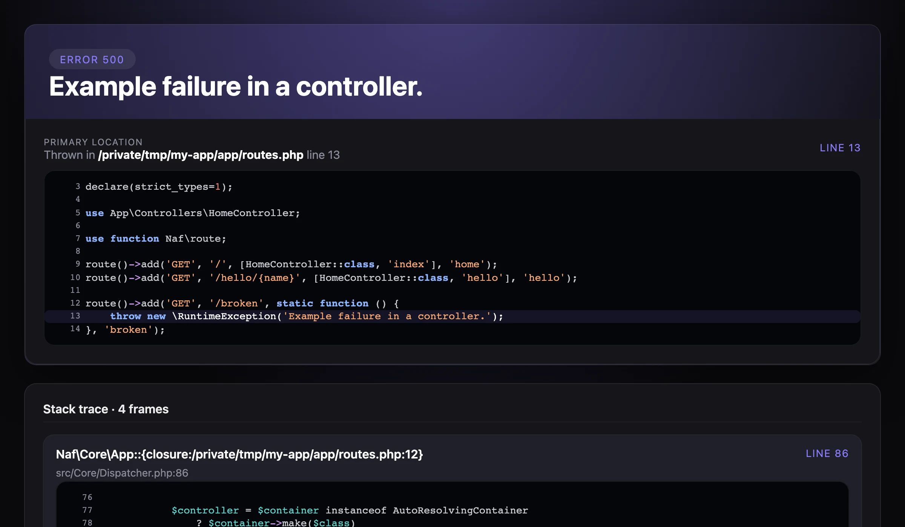
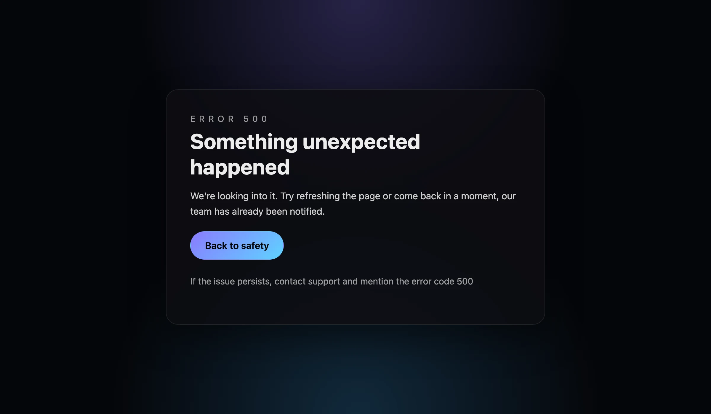

# Errors and aborting

An unknown route, a thrown exception or `abort()` reaches the error-handling path.
The default response uses the exception's `getStatusCode()` when available, otherwise 500.

## Abort a request

```php-inline
use function Naf\abort;

abort(404, 'The requested item was not found.');
```

`abort()` throws `Naf\Exceptions\AbortException`; it does not render a template or send a
response itself. Code after the call is not executed unless an outer layer catches the exception.
Avoid catching and discarding it inside a broad `catch (Throwable)`.

`abort()` passes the message through `htmlspecialchars()` before storing it, so
`$exception->getMessage()` returns `&quot;`, `&lt;` and similar entities for such characters.
Keep abort messages plain, or decode them with `htmlspecialchars_decode()` when a JSON
listener returns them to clients.

## Default output

The core supplies diagnostic and sanitized error templates. `APP_ENV=prod` and `APP_ENV=test`
use sanitized output; `dev` shows diagnostics. Use the exact names documented in
[Configuration](configuration.md#application-environment).

=== "APP_ENV=dev"

    { .screenshot loading=lazy }

=== "APP_ENV=prod"

    { .screenshot loading=lazy }

Both pages answer an exception thrown by a route handler with status 500. The diagnostic
page shows file paths and source code, which is why it must never reach production.

Placing `app/views/errors/404.phtml` in your application **does not automatically override**
the core error handler. To customize an error, return a response from the `exception` event.

## Customize an HTTP error

Register this in `bootstrap.php`, after the autoloader and before `app()->run()`:

```php-inline
use Naf\Core\{ErrorHandler, Event};
use function Naf\{event, response};

event()->listen(Event::EXCEPTION, function (\Throwable $exception) {
    if (ErrorHandler::resolveStatusCode($exception) !== 404) {
        return null; // Keep the default response for other failures.
    }

    return response('<h1>Page not found</h1>', 404, [
        'Content-Type' => 'text/html; charset=UTF-8',
    ]);
});
```

With `naf/view`, you can instead return `Naf\View\render('errors.404')->withStatus(404)`.
Pass any template data explicitly; no `$path` variable is injected automatically.

## JSON errors for an API

For expected validation failures, return `json($payload, 422)` from your handler. To cover
uncaught exceptions as well, register this before `app()->run()`:

```php-inline
use Naf\Core\{ErrorHandler, Event};
use function Naf\{event, json, log, request};

event()->listen(Event::EXCEPTION, function (\Throwable $exception) {
    if (!str_starts_with(request()->getUri()->getPath(), '/api/')) {
        return null;
    }

    log()->error('API request failed: {exception}', ['exception' => $exception]);
    $status = ErrorHandler::resolveStatusCode($exception);
    return json(['error' => $status >= 500 ? 'Internal server error' : 'Request refused'], $status);
});
```

Do not expose unexpected exception messages to clients. When a listener returns its own
response, it should also perform any logging you need. This hook handles failures during the
request cycle; a parse error in the bootstrap itself may occur before the listener exists.

Use [Logging and troubleshooting](troubleshooting.md) to diagnose failures without exposing details to clients.
