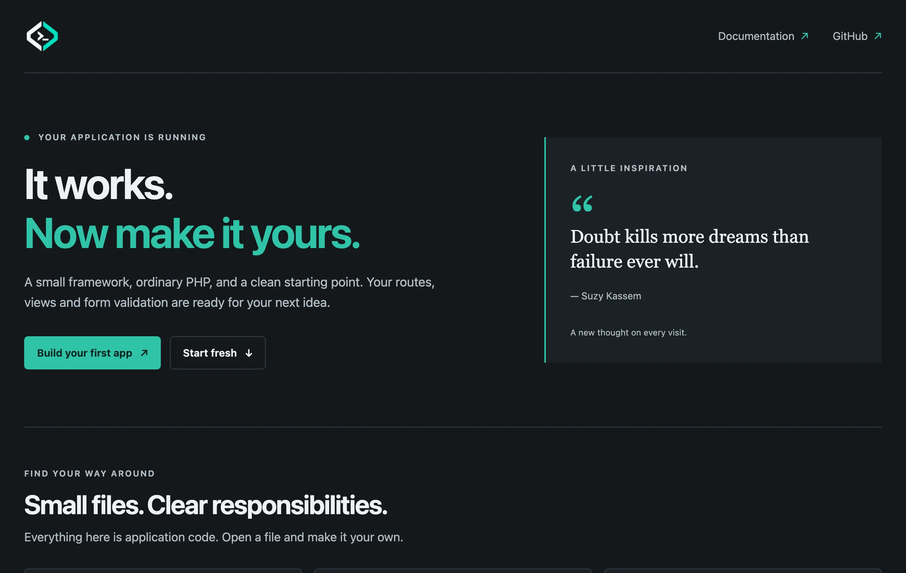
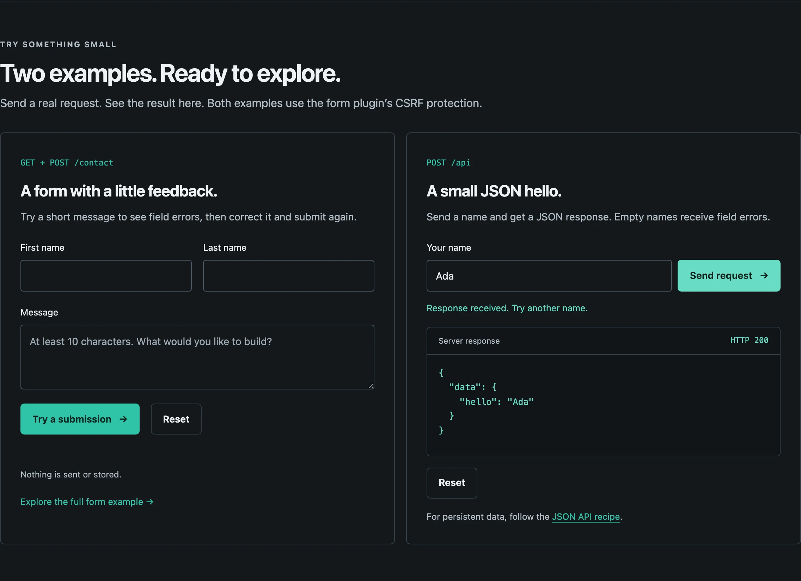

# Installation

Start a local NAF application and check its first HTTP response. For your first project,
use the starter below; it provides the application layout and a working welcome page.
The [core-only project](#core-only-project) is an alternative for a small HTTP service.
The Composer vendor is **`naf`**; `nafphp` is the GitHub organisation.

## Requirements

- PHP 8.3 or newer and Composer.
- PHP's JSON and PDO extensions. Forms also use `mbstring`; database access needs the PDO driver for your database.
- A writable project directory. Sessions and logs need writable storage at runtime.

## Start with the application skeleton

Run this from the directory in which you keep your projects:

=== "macOS / Linux"

    ```bash
    composer create-project naf/app nafphp-demo
    cd nafphp-demo
    APP_ENV=dev php -S 127.0.0.1:8000 -t public
    ```

=== "Windows (PowerShell)"

    ```powershell
    composer create-project naf/app nafphp-demo
    cd nafphp-demo
    $env:APP_ENV = "dev"; php -S 127.0.0.1:8000 -t public
    ```

`APP_ENV=dev` selects detailed local error pages for this server process. You can instead
put `APP_ENV=dev` into a `.env` file in the project root, which works on every platform;
[Your first application](first-app.md) does that.

Open **http://127.0.0.1:8000/**. You should see the NAF welcome page:

{ .screenshot loading=lazy }

Stop the development server with Ctrl+C. Keep it bound to localhost; on a deployed site,
configure the web server's document root as this project's `public/` directory.

The starter installs `naf/framework`, `naf/view` and `naf/form`; `naf/session` arrives through
the form package. It also registers the `App\` namespace with Composer.

The welcome page links to the source files that produce it and includes two interactive
examples: a contact form and a JSON request. They use `fetch()` to show field errors,
success feedback, the JSON response and the HTTP status without leaving the page; the
normal form submission still works without JavaScript. Both examples are protected by the
form plugin's CSRF check. The contact form only validates; it does not send or store a
message. **Start fresh** opens the cleanup steps, with Copy buttons for the terminal
commands; it does not delete files itself. The `showQuote` setting in `app/config.php`
switches the rotating quote panel off.

{ .screenshot loading=lazy }

Continue with [Your first application](first-app.md). It replaces the starter demonstration
with complete files you can copy, then verifies both an HTML page and a JSON endpoint.
You can follow it directly after a fresh installation. If you are continuing an older project,
check [starter versions and updates](#starter-versions-and-updates) first.

### If the welcome page does not appear

| What you see | What to try |
|---|---|
| Composer reports a missing PHP extension | Enable the named extension for the PHP binary running Composer; `php --ini` shows its configuration files |
| The server cannot bind port 8000 | Stop the earlier server or use a free port, such as 8001, in both the command and browser URL |
| The browser cannot connect | Keep the terminal running the PHP server open and use the address printed there |
| A PHP error or unexpected page | Confirm this terminal is in `nafphp-demo/` and that the server uses `-t public`; inspect its terminal output |

For more detail, use [Troubleshooting](troubleshooting.md#routing-and-bootstrap). You can
return to installation after resolving the specific error; a new project is usually unnecessary.

## Core-only project

For a service without templates or browser forms, create an empty directory and these files.
This is a separate starting point; do not replace the starter's Composer file with this one.

```bash
mkdir naf-api
cd naf-api
mkdir -p app public
```

```json title="composer.json"
{
    "name": "example/naf-api",
    "require": { "php": ">=8.3", "naf/framework": "^0.2" },
    "autoload": { "psr-4": { "App\\": "app/" } }
}
```

```bash
composer install
```

```php title="bootstrap.php"
<?php

define('BASE_PATH', __DIR__);
require __DIR__ . '/vendor/autoload.php';

use function Naf\app;

app()->run();
```

```php title="public/index.php"
<?php

require dirname(__DIR__) . '/bootstrap.php';
```

```php title="app/routes.php"
<?php

use function Naf\{json, route};

route()->add('GET', '/', fn() => json(['ok' => true]), 'home');
```

```ini title=".env"
APP_ENV=dev
```

```bash
php -S 127.0.0.1:8000 -t public
```

In another terminal, `curl http://127.0.0.1:8000/` should return `{"ok": true}`
(with whitespace for readability). This path needs no view, form, session or database plugin.
For a complete application using this structure, continue with the
[JSON API without a database](recipes/simple-json-api.md). Follow that tutorial in its own
directory; it includes its own bootstrap, routes and Composer file.

## Starter versions and updates

These notes are for checking an existing project or choosing dependency updates. A fresh
starter installation can proceed directly to [Your first application](first-app.md).

??? info "Versions included in starters 0.2.2 and 0.2.3"

    Starters **0.2.2** and **0.2.3** ship the same working dependency lock: framework 0.2.3,
    form 0.2.2, session 0.2.1 and view 0.2.1. They exclude Nyholm PSR-7 below 1.8.2 to avoid
    PHP 8.4+ deprecation errors. The welcome page, `/contact` form and POST `/api`
    demonstration work directly after installation; no extra Composer update or response
    listener is needed. Starter 0.2.3 adds the interactive welcome page and **Start fresh**
    guidance; its dependencies are unchanged.

    Newer compatible releases exist, for example framework 0.2.8 and form 0.2.3, which
    checks CSRF for every state-changing method. The [package overview](packages.md) lists
    the current versions.

For an application created from an older starter, update the required minimum versions:

```bash
composer require 'naf/framework:^0.2.2' 'naf/form:^0.2.3' --with-all-dependencies
```

To move a new or existing project to the current compatible releases, run `composer update`
and test your application before deploying it. Commit `composer.lock`; deployments should use `composer install` to reproduce
that tested dependency set.

## Environment and next steps

Use `APP_ENV=dev` locally, `APP_ENV=test` for tests and **`APP_ENV=prod`** in production.
Use these exact values: `production` is not the production constant. Keep `.env` and
`.env.local` out of version control. See [Configuration](configuration.md).

- [Your first application](first-app.md) — a website and a JSON endpoint.
- [Application scenarios](recipes/index.md) — complete small projects, from two HTML pages to a storage-free JSON API.
- [Choosing packages](choosing-packages.md) — add only what your application needs.
- [Requests and responses](request-response.md) — read incoming data and return a response.
