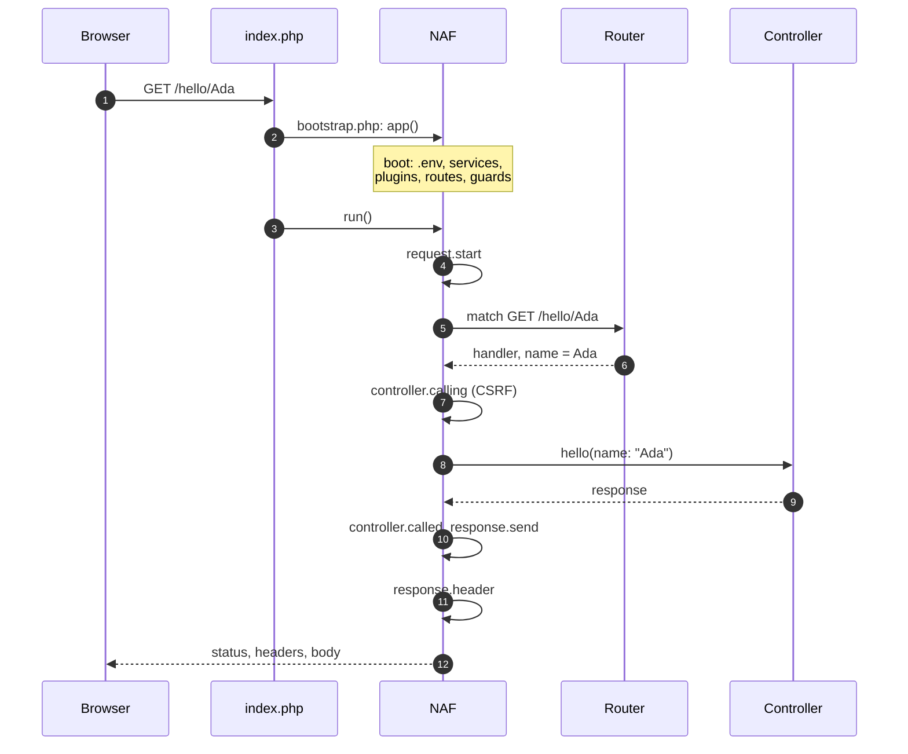

# Application lifecycle

The first `app()` call boots NAF. `app()->run()` then handles the HTTP request. This order
determines where to register services, routes and listeners.

## Application boot

In the [starter](first-app.md), `public/index.php` requires root `bootstrap.php`. The bootstrap
defines `BASE_PATH`, loads Composer, registers application services and calls `app()->run()`.

The first `app()` creates `App` with `AutoResolvingContainer(new Container())`. Boot:

1. Loads `.env.local` if present, otherwise `.env`.
2. Registers core services, including configuration, routing, events, logging and errors.
3. Discovers installed Composer packages with type `naf-plugin` and registers all plugins.
4. Resolves plugin order, then loads each plugin's routes and helpers before its bootstrap.
5. Loads application routes and registers core guard rules, including under CLI since
   Framework 0.2.9.

Configuration is resolved lazily and merged in core, plugin, application order. Application
values win. See [Configuration](configuration.md) and [Plugin order](plugins.md#boot-order).

## Code locations and timing

| Location | Purpose | Timing |
|---|---|---|
| `app/config.php` | Return configuration arrays | When configuration is first resolved |
| `app/routes.php` | Register handlers and names | During the first `app()` call |
| Root `bootstrap.php` | Register application services and listeners | After autoloading, before `run()` |
| Controllers | Validate HTTP input and return responses | When a route matches |
| Application services | Implement business rules and persistence | When application code constructs or calls them |

`app()->container()` already triggers boot, including route loading. Route files should
register handlers, rather than resolve services whose application bootstrap bindings do not
yet exist. Constructor injection and lazy factories resolve dependencies later.

Configuration files return arrays without queries or delivery operations. Plugins must be
installed through Composer. Application helper files need `autoload.files` or an explicit include.

A plugin's helper functions, such as `Naf\CLI\command()`, `Naf\Queue\queue()` or
`Naf\View\render()`, are loaded while NAF boots the plugin during the first `app()` call.
Code in root `bootstrap.php` that uses them must run after that call. Starting a registration
block with `app()` or `app()->container()` is enough:

```php-inline
use function Naf\app;
use function Naf\CLI\command;

app(); // Boots NAF and every installed plugin.
command()->add(\App\Commands\HelloCommand::class);
```

## HTTP handling

During `run()`, NAF:

1. Creates and registers the PSR-7 server request.
2. Dispatches `request.start` and matches an HTTP method and path.
3. Constructs a controller through the default container, or selects a closure.
4. Dispatches `controller.calling` and invokes the handler with named route parameters.
5. Receives a PSR-7 response and dispatches `controller.called`.
6. Finalizes and emits status, headers and body through the response events.



After the body, NAF dispatches `response.body` and `response.end`. An exception at any step
after boot leaves this path: an `exception` listener may return a
response, otherwise the error handler renders one, and the response events still run.

Routing and controller exceptions enter the [error path](errors.md). An `exception` listener
can return a response; otherwise the error handler renders one. Normal emission terminates
the request. Controllers return responses rather than echoing output or sending headers.

See [Events](events.md#request-lifecycle) for payloads and replacement behavior. To change
headers, return a new response from `response.header`. A response returned from
`controller.called` or `response.send` does not replace the emitted response.

## CLI and workers

Under CLI, `app()->run()` returns without routing or emitting HTTP. Commands still use
application boot, services and configuration. Test routing through a running HTTP application.
Framework 0.2.9+ also registers the core guard rules under CLI, so View rendering and HTML
escaping work in commands and workers after boot.

Workers can process many jobs in one process. Shared services and plugin state can survive
between jobs; do not keep request identities or mutable job data in shared services. Bound
worker lifetimes and restart them after deployments. See [Queues](queues.md) and [Testing](testing.md).
