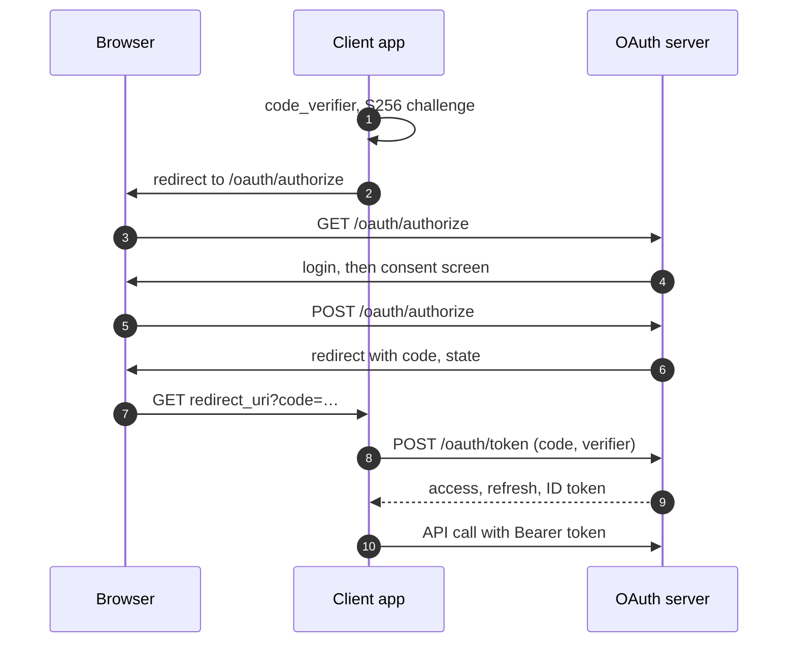

# OAuth authorization server { #being-the-provider }

`naf/oauth-server` provides an OAuth 2.0 authorization server and OpenID Connect provider
using existing NAF Auth accounts. Other applications can obtain access tokens and, with the
`openid` scope, verify user identities.

This guide requires `naf/oauth-server` 0.2.5+ and PHP 8.3+.

Deployment requires a configured issuer, database migrations, registered clients and scopes.
User grants also need local login; OpenID Connect needs signing keys. The sections below
describe those steps and the guarantees required from the database.

## Supported grants and protocols { #what-this-plugin-is }

The server uses NAF Auth identities and access checks. It does not create a separate user
model or account registration system.

| Grant | Purpose |
| --- | --- |
| **Authorization Code** | with PKCE/S256, mandatory for every client, confidential ones included |
| **Refresh Token** | with strict rotation and replay detection |
| **Client Credentials** | for an application acting as itself |

OpenID Connect comes with it: ID tokens, UserInfo, discovery and a published key set. A client
opts into it per request by asking for the `openid` scope — it is not a mode the server is in.

Deliberately not offered: the Implicit and Password grants, wildcard redirect URIs, and the
`max_age` and `prompt` parameters.

The authorization code flow with PKCE, as a client application uses it. Step 2 sends
`client_id`, `redirect_uri`, `scope`, `state` and the `code_challenge`; step 8 authenticates
confidential clients and sends the original `code_verifier`. The ID token is returned only
when the client asked for the `openid` scope.



---

## Configuration

```php-inline
// app/config.php
return [
    'public_url'   => 'https://id.example.com',
    'oauth_server' => [
        'name'   => 'Acme ID',
        'scopes' => [
            'posts.read'  => ['label' => 'Read your posts',  'permission' => 'posts.view'],
            'posts.write' => ['label' => 'Write your posts', 'permission' => 'posts.edit'],
        ],
    ],
];
```

Add this configuration to `app/config.php`. The issuer and display name are required;
application scopes define the API operations clients may request.

**`audience` stays empty for the ordinary case** — one server, one API, tokens that carry no
target. Set it only when this installation serves an API that clients name explicitly with the
`resource` parameter:

```php-inline
'oauth_server' => ['audience' => 'https://reports.example.com', …],
```

When audience validation is configured, a token granted for another resource is rejected.
The grant's resource persists through refresh; changing client registration does not retarget it.

`oauth_server:name` is a required display label. It does not change the issuer, client IDs,
redirect URIs or subject identifiers. Relying parties configure their own display labels.

Scopes describe requested API access; permissions describe the account's authority. A scope
can map to a permission. If `permission` is omitted, the scope name is used; a string scope
definition supplies its label. Explicit `permission => null` means no additional account
permission and is appropriate only for scopes you deliberately allow that way. Boolean,
numeric, array, object, empty-string and whitespace-only values are configuration errors;
they never mean `null`. OAuth server 0.2.5+ validates the whole policy when it is constructed
and before the built-in token endpoint can issue a grant. [Alexa setup and diagnostics](alexa.md)
use the same policy. Correct the configuration before serving requests; this error is a server
failure, not a client's `invalid_scope`.

The built-in `openid`, `profile` and `email` scopes expose the consenting account's identity
and allowed profile data. They do not require an additional application permission.

The sign-in page is found on its own when a route is named `login`; otherwise name it in
`oauth_server:login_route`. PKCE and the protocol errors are already set.

### Lifetimes

All lifetimes are integers in seconds:

| Key | Default | Effect |
| --- | --- | --- |
| `oauth_server:access_token_ttl` | `3600` | Access-token lifetime: one hour. |
| `oauth_server:refresh_token_ttl` | `2592000` | Refresh-token lifetime: 30 days. Local browser-session lifetime is configured separately. |
| `oauth_server:id_token_ttl` | `3600` | ID-token lifetime: one hour; minimum retired-key retention. |
| `oauth_server:code_ttl` | `60` | Authorization-code lifetime: one minute. |
| `oauth_server:consent_ttl` | `600` | Pending consent-request lifetime: ten minutes. |

### Profile claims { #saying-more-than-who }

`UserInterface::getProfile()` supplies the standard profile data. Configure a claims mapper
only when the application needs additional mapping.

Configure `oauth_server:claims` only for something the profile does not cover:

```php-inline
'oauth_server' => ['claims' => static fn(User $user): array => ['locale' => $user->locale]],
```

The mapper adds to the profile. Output is filtered by granted scopes: `email` releases
email claims and `profile` releases profile claims. Without those scopes, their associated
claims are omitted. ID tokens still include the required protocol and subject claims.

---

## Database and key setup { #setting-it-up }

Install `naf/cli` for the setup and management commands, and configure a PDO connection
(usually through `naf/database`). Existing local users and a login route are prerequisites;
see [Authentication](auth.md#quickstart).

```bash
composer require naf/cli naf/database
vendor/bin/naf oauth:server:setup
```

The installation command creates a signing key when absent and reports remaining setup
requirements. Run it after configuring the database and local login.

`vendor/bin/naf oauth:server:doctor` answers the same question later, when something has
stopped working and you want to know which part.

## Register a client { #registering-an-application }

```bash
vendor/bin/naf oauth:client:create "Acme Intranet" \
    --redirect=https://intranet.example.com/auth/callback \
    --scope=posts.read,posts.write
```

```text
  Acme Intranet
  Client ID       9f2c…
  Client secret   7b41…

  Copy the secret now. It is stored only as a hash and cannot be shown again.
```

Add `--public` for an application that cannot keep a secret — a mobile or desktop client. It is
then identified rather than authenticated, and PKCE is what protects its exchange.

`vendor/bin/naf oauth:client:list` shows what is registered.

**A public client cannot be given `--grant=introspection`.** A client id is not a secret — it
travels in every authorize URL — so a public client with that right would let anyone who has
ever seen a login link ask about anybody's tokens. The registry refuses the combination, and
the endpoint refuses it again.

### Rotating a client secret

```bash
vendor/bin/naf oauth:client:rotate-secret 9f2c…              # old one keeps working for a day
vendor/bin/naf oauth:client:rotate-secret 9f2c… --overlap=3600
vendor/bin/naf oauth:client:rotate-secret 9f2c… --now        # after a leak
```

Secret rotation preserves the client ID and existing authorizations. Deploy the new secret
to the client application during the configured overlap.

During the overlap, the current and previous secrets are accepted. Rotating again replaces
the previous secret; only two are retained. `--now` invalidates the previous secret immediately.

Use immediate rotation when the previous secret must no longer authenticate. Coordinate
client deployment because its old configuration will fail.

The previous secret expires automatically. `oauth:client:list` and `oauth:server:doctor`
report open rotation windows for operational verification.

---

## Protecting an API

```php-inline
use function Naf\OAuth\Server\token;

public function store(): ResponseInterface
{
    token()->requireScope('posts.write');

    $user = token()->user();   // your own model, or null for an application

    …
}
```

`requireScope()` raises 401 when no usable token was presented and 403 when the one that was
does not reach. `can()` is the same check as a plain bool.

### Token scopes and current permissions { #two-things-have-to-hold-every-time }

- the **token** carries the scope — what the person agreed this application may do for them;
- the **person** still holds the permission behind it — what they may do at all.

User-token authorization checks the token scope and the account's current permission.
A permission removed from the account is denied on a subsequent check.

A client-credentials token represents an application. `user()` returns `null`; authorization
uses the client's registered grants and token scopes.

### Bearer authentication and sessions { #bearer-and-session-are-separate-worlds }

There is no path from `token()` to a session. An expired, revoked or invented bearer token
cannot quietly fall back to whoever happens to be signed in with a cookie — a request with no
usable token has no usable token, whatever else it carries.

---

## Endpoints

| Route | Purpose |
| --- | --- |
| `GET /oauth/authorize` | ask the person |
| `POST /oauth/authorize` | their answer — CSRF-protected like any other form |
| `POST /oauth/token` | the three grants |
| `POST /oauth/revoke` | RFC 7009 |
| `POST /oauth/introspect` | RFC 7662, for a resource server elsewhere |
| `GET`/`POST` `/oauth/userinfo` | claims about whoever a token was issued for |
| `GET /.well-known/openid-configuration` | OpenID Connect discovery |
| `GET /.well-known/oauth-authorization-server` | OAuth authorization-server metadata (0.2.4+) |
| `GET /.well-known/jwks.json` | the keys to check its signatures with |

Off with `'oauth_server' => ['routes' => false]`. The endpoints stay reachable through the
container.

Programmatic token, revocation and introspection endpoints use protocol authentication
instead of the session-wide CSRF listener. Exemptions use exact route names in
`csrf_exempt_routes`. The consent route uses a separate request-bound CSRF check.

Introspection requires a confidential client explicitly registered with
`--grant=introspection`. Ordinary client registration does not grant token inspection.

OAuth-only discovery needs no signing key. It advertises authorization code, refresh,
client credentials and PKCE S256. Set `public_url` to the stable public HTTPS origin used in
the returned endpoint URLs.

### Resource-bound code exchange

Since 0.2.4, authorization-code token requests can supply `resource`. The PDO store compares
it with the audience recorded at authorization, inside the atomic code claim. A mismatch
returns `invalid_grant`, consumes the attempted code and issues no tokens. Empty or non-string
resources return `invalid_request` before claiming the code. Omitting the parameter preserves
existing behavior. Refresh keeps the original audience without requiring `resource` again.

Custom stores can implement `ResourceTokenStoreInterface`, an additive extension of
`TokenStoreInterface` with `redeemForResource(...)`. The existing `redeem()` signature is
unchanged. Supplying a resource to an adapter without the new contract returns `invalid_target`.
Verify the binding while atomically claiming the code, rather than in separate transactions.

For MCP, configure the canonical `/mcp` URI as the audience and register that exact URI for
each client. Use separate service and account-linking clients; [Alexa+](alexa.md) automates
these registrations.

### Redirect and reauthentication requirements { #what-a-request-has-to-say-and-what-it-will-not-get-away-with }

**`redirect_uri` is required** — in the authorization request and again at the token endpoint,
even for a client with exactly one registered URI. PKCE binds the exchange to the browser that
started it; this binds it to where the code was sent. They answer different questions, and
RFC 6749 §4.1.3 asks both.

Consent is always interactive and the server does not record the last authentication time.
Requests using `prompt` or `max_age` therefore have these results:

| Request | Result |
| --- | --- |
| `prompt=none` | `interaction_required` |
| `prompt=login` | `invalid_request` — re-authentication cannot be forced |
| `max_age=…` | `invalid_request` — the last authentication time is not recorded |
| `prompt=consent` | satisfied, because consent is always asked for |

These errors prevent clients from treating an ordinary session as proof of forced or
recent reauthentication.

---

## Consent screen { #the-consent-screen }

Shipped, and overridden by putting your own `oauth/consent.phtml` in the application's view
directory. Nothing in the central configuration has to change for that.

Its CSRF token belongs to the one request it was rendered for, derived from that request and
keyed by the session. A single session-wide token cannot do that job: issuing the second one
invalidates the first, so two consent screens open at once would break each other. This route is
therefore exempt from the session-wide check and carries its own — it is not unprotected.

The browser is handed an opaque request id and nothing else — no client, no scope, no redirect
URI. Consent is given for the request **the server validated**, and what comes back is only ever
a key to look it up by. It is bound to the browser it was asked in and to the person who was
asked: if somebody else signs in between the question and the answer, the request is void.

---

## Signing keys

One key signs; every key stays published until you say otherwise. That is what makes rotating
safe:

```bash
vendor/bin/naf oauth:keys:generate    # the new key signs from now on
vendor/bin/naf oauth:keys:prune       # remove the old ones, once their tokens have expired
```

`prune` measures retirement age, not creation age. Retain retired public keys until their
issued ID tokens have expired. The active key cannot be pruned, and retention shorter than
the configured ID-token lifetime is rejected.

They live in `storage/oauth/keys` unless `oauth_server:key_path` says otherwise — which it has
to, when several servers share one set: they are files, and nothing replicates them for you.

Keys are files, not rows, and are never generated on demand. A key that appears when a request
needs one is a key that differs on the second server, and every token signed by the one that
went away stops verifying.

---

## Identity and account mapping { #the-same-user-contract }

The server uses the application's Auth identity model, including `UserInterface`,
`isActive()` and `getProfile()`. Account activity and permission checks apply when the server
reloads the identity; there is no separate OAuth user table.

---

## Protocol boundaries { #some-decisions-and-why }

Access tokens are opaque credentials stored as hashes. Local validation checks their
current state; a remote resource server uses authenticated introspection. ID tokens are
signed JWTs for OpenID Connect clients.

Refresh tokens rotate strictly. Reusing a spent token revokes its family; there is no grace
window for duplicate refreshes. Clients should serialize refresh requests. The family row
coordinates issuance with revocation so a concurrent successor cannot bypass replay detection.

An authorization code submitted with the wrong client, redirect URI, PKCE verifier or resource
is consumed. An internal failure rolls the exchange back. Codes and bearer tokens are stored
as SHA-256 hashes; client secrets use Auth's password hasher.

Account identity consists of provider and account ID. The public OIDC subject is a separate
stable opaque identifier. Activity checks use the same Auth identity contract as local login.

### Database concurrency

SQLite serializes writes and is useful for local examples. PostgreSQL and MySQL exercise
concurrent row-locking behavior that SQLite alone cannot validate. Correct code redemption,
refresh rotation and family revocation depend on transactions and the database's locking.

For server changes or a deployment-specific database validation, use disposable databases and
the package's [concurrency checks](https://github.com/nafphp/oauth-server/blob/v0.2.4/tests/Concurrency/README.md).
They check simultaneous redemption and revocation/refresh races on SQLite, PostgreSQL and MySQL.
Unit tests alone do not establish these guarantees.

### Upgrading

No database migration is needed when upgrading from 0.2.3 or 0.2.4 to 0.2.5.
Review custom scope definitions: explicit `permission` values must be null or nonempty
strings. Ensure account-linking clients generate valid PKCE S256 verifiers and challenges
as described below.

For databases predating the current 0.2 schema, the schema is not backward compatible:
authorizations carry their target API, families have their own rows, and clients carry the
secret they last replaced. For a disposable development database created from an earlier
schema, rebuild the tables after backing up anything you need. For a deployed database, write and test a
forward migration; do not drop its tables:

```bash
vendor/bin/naf db:migrate up      # after dropping the oauth_* tables of an earlier run
```

On MySQL the identifier columns are given a binary collation, because the default one is
case-insensitive and these hold values where `aB` and `Ab` are different identifiers.

---

## PKCE format and consent responses

OAuth server 0.2.5+ requires a verifier of 43–128 unreserved ASCII characters:
letters, digits, `-`, `.`, `_` and `~`. The S256 challenge is exactly 43 unpadded base64url
characters. Missing or malformed values and unsupported `plain` return `invalid_request`;
a well-formed proof that does not match the code returns `invalid_grant`. Generate a fresh
cryptographically random verifier for every authorization. Format validation cannot establish
how a client generated its randomness. These requirements follow [RFC 7636](https://www.rfc-editor.org/rfc/rfc7636.html#section-4.1).

Consent HTML, protocol-error pages and redirects sent by the authorization controller have
`Cache-Control: no-store`, `Pragma: no-cache`, `Referrer-Policy: no-referrer`,
`X-Frame-Options: DENY` and `Content-Security-Policy: frame-ancestors 'none'`. Keep these
headers when overriding consent views or composing responses. Apply suitable protection to
the host's own login screen too.

The consent POST uses its request-bound HMAC CSRF check. Its exact-route exemption from
`naf/form` is intentional: replacing it with the session-wide token would invalidate parallel
consent forms. Stored consent binds the session, provider and user; the submitted form cannot
replace the validated client, redirect, resource or scopes.

Authorization state is request-scoped. The supported front controller boots a fresh application
for each web request and exits after emission. `ResourceServer` caches its bound request's
context. A custom persistent HTTP adapter must create a fresh application/container and
request-bound services for every request; rebinding only `ServerRequestInterface` leaves
already-resolved services holding the old request. Reusing those instances is unsupported.

The PDO store does not automatically delete old OAuth rows. Plan database retention and monitor
growth. In particular, used codes and refresh-token tombstones support replay detection: deleting
them while their authorization family can still issue tokens weakens that guarantee. Implement
and test retention against family lifetimes and concurrent refresh/revocation before scheduling it.
Keep subject mappings stable while their accounts remain linked. Key pruning is a separate
operation and does not prune token or consent tables.
