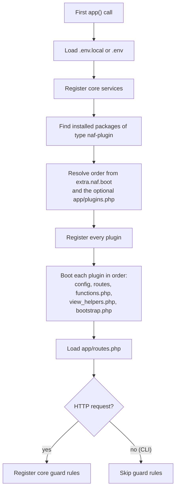

# Plugins

A NAF plugin is an installed Composer package of type `naf-plugin`. NAF discovers it through
Composer's installed-package metadata and loads its conventional resources. A cloned sibling
directory is not an installation; declare dependencies in the consuming application's manifest.

See [Application lifecycle](lifecycle.md) for when plugin boot occurs. [Choosing packages](choosing-packages.md)
helps select existing plugins before writing a new one.

## Plugin discovery <span id="automatic-discovery"></span>

Packages of another type, including the old `nixphp-plugin`, are not discovered as NAF plugins.
Required dependencies belong in Composer `require`; `app/plugins.php` only influences order.

## Plugin layout { #plugin-structure }

Use one conventional layout per package:

```text
example-plugin/
├── src/
│   ├── Controllers/HelloController.php
│   ├── config.php
│   ├── functions.php
│   └── routes.php
├── bootstrap.php
└── composer.json
```

The loader accepts `app/` variants too, with the first existing candidate winning. Config
files return arrays; routes register handlers; bootstrap registers services and listeners.
Views additionally require View. Do not create competing copies of the same resource.

## Package manifest { #example-composerjson }

Create this `composer.json` in the plugin repository. It maps `ExamplePlugin\` to `src/`:

```json title="composer.json"
{
    "name": "example/naf-hello",
    "description": "Example response-producing NAF plugin",
    "type": "naf-plugin",
    "license": "MIT",
    "require": { "php": ">=8.3", "naf/framework": "^0.2" },
    "autoload": { "psr-4": { "ExamplePlugin\\": "src/" } }
}
```

Install the package in the host using its published Composer name. During local development,
a Composer path repository can point to its checkout; keep that development-only repository
out of a published package manifest. Regenerate host autoloading after manifest changes.

## Routes and controllers { #example-plugin-routing-to-a-controller }

Create `src/Controllers/HelloController.php` in the plugin:

```php title="src/Controllers/HelloController.php"
<?php

declare(strict_types=1);

namespace ExamplePlugin\Controllers;

use Psr\Http\Message\ResponseInterface;
use function Naf\json;

final class HelloController
{
    public function index(): ResponseInterface
    {
        return json(['message' => 'Hello from the plugin']);
    }
}
```

Create `src/routes.php`:

```php title="src/routes.php"
<?php

use ExamplePlugin\Controllers\HelloController;
use function Naf\route;

route()->add('GET', '/plugin-hello', [HelloController::class, 'index'], 'example.hello');
```

In a host with the plugin installed, GET `/plugin-hello` returns 200 and the JSON message.
Application routes load last and can replace a plugin registration with the same route name.

## Services and listeners { #example-plugin-event-listener }

Register lazy services and listeners in the plugin's root `bootstrap.php`. For example:

```php title="bootstrap.php"
<?php

use function Naf\{event, log};

event()->listen('import.completed', static function (int $count): void {
    log()->info('Imported ' . $count . ' records.');
});
```

After an application import succeeds, `event()->dispatch('import.completed', $count)` invokes
that listener. Custom event names have no effect until code dispatches them. Class listeners
use constructor injection through the default container. See [Events](events.md).

## Resource precedence { #view-resolution-order }

Application view paths take precedence over plugin paths. Within plugins, resolved plugin
order governs precedence. Use the same relative template path to override a plugin view.

### Configuration merging { #config-merge-order }

Configuration merges core defaults, plugin configuration and application configuration in
that order. Later values win recursively; numeric arrays replace by position. See
[Configuration](configuration.md#merge-order).

## Plugin metadata { #accessing-plugin-metadata }

```php-inline
use function Naf\plugin;

$plugins = plugin();
$view = plugin('naf/view');
$paths = $view->getViewPaths();
```

This fragment assumes View is installed. Asking for an absent plugin throws; inspect
`app()->hasPlugin('naf/view')` before optional access. Registration does not prove boot has
finished. Use `isBooted()` on the plugin when that distinction matters.

## Flow { #flow-development-guide }

[Flow](flow.md) adds native browser components to PHP views. It uses the same plugin boot,
asset collection and HTTP response mechanisms described here.

## Boot order



Framework 0.2.7+ reads boot order from each installed plugin's `composer.json`. All plugins
are registered before any bootstrap runs. `hasPlugin()` says a plugin is registered;
`isBooted()` says its bootstrap has finished. Prefer lazy service factories when another
plugin's service is only needed later.

A plugin that needs another bootstrap to finish first declares that relationship itself:

```json
{
  "extra": {
    "naf": {
      "boot": {
        "after": ["naf/cli"],
        "before": ["naf/board"]
      }
    }
  }
}
```

`before` and `after` are optional lists of exact Composer package names. They order only
installed plugins: a missing optional target is skipped, never installed. Declare required
packages separately in Composer `require`. A requirement alone creates no boot edge; a Board
extension can require Board's API while booting before Board to register its provider.

The framework validates the complete graph before running plugin code. Invalid declarations
and cycles fail with the packages and source declarations involved. Unconstrained plugins
are ordered by package name, so Composer discovery order does not change the result.
The same order governs plugin configuration and view resource precedence. Host configuration
and host routes retain their final override position; a plugin's routes and helper files
load before its own root bootstrap.

An installation may still return a partial preference list from `app/plugins.php` or
`src/plugins.php`:

```php
<?php

return ['naf/session', 'naf/form'];
```

Listed installed packages keep their relative order and receive priority among ready
plugins. Other installed plugins still load. A preference conflicting with a plugin's
`before` or `after` declaration fails with a cycle rather than silently changing that
plugin's prerequisite. Application routes load after all plugin bootstraps; application
service bindings belong in the root `bootstrap.php` before `app()->run()`.

With `naf/cli` 0.2.3+, run `vendor/bin/naf plugins:debug` to see the resolved order,
prerequisites and skipped optional targets. For the starter with `naf/cli` added:

```text
--8<-- "output/plugins-debug.txt"
```

`App::getPluginBootPlan()` exposes the same information to application code.

The loader also accepts `src/config.php`, `src/routes.php` and `src/functions.php` when their
`app/` counterparts are absent. Keep one layout per package to avoid competing files.

## Code style and readability

For plugin contributions, follow the shared
[NAF code style](https://github.com/nafphp/docs/blob/main/CODE_STYLE.md): PER Coding Style 3.0
with descriptive local names, separate logical steps and locally aligned assignments.
The guide includes a formatter configuration and Composer commands for individual packages.
Packages adopt `composer style:check`, `composer style:fix` and CI checks individually.
Check the package's own scripts and instructions for the commands it supports.

Keep ordinary PHP operations simple. Add a helper or service when it has a useful
responsibility, and preserve the package's public API, evaluation order and cleanup behavior
when improving readability.
