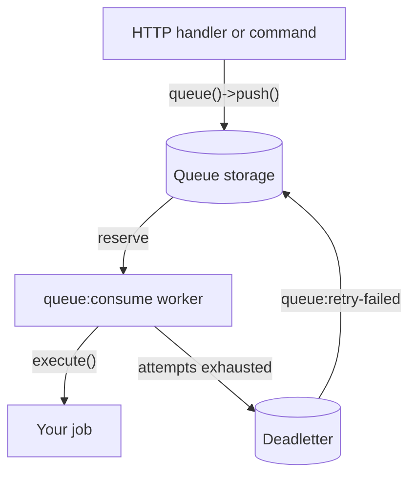

# Queues and workers

`naf/queue` separates job submission from execution. An HTTP handler enqueues data and returns;
a CLI worker constructs the job and calls `execute()`. Installing Queue also installs CLI.
The default file driver needs writable local storage and a running worker.



## A job

Start from [Your first application](first-app.md), install Queue, and create this file. The
example writes a confirmation to worker output without sending mail or modifying accounts.

```php title="app/Jobs/RecordSignup.php"
<?php

declare(strict_types=1);

namespace App\Jobs;

use Naf\CLI\Core\Output;
use Naf\Queue\Core\QueueJobInterface;

final class RecordSignup implements QueueJobInterface
{
    public function __construct(private array $payload) {}

    public function execute(Output $output): void
    {
        $id = $this->payload['user_id'] ?? null;
        if (!is_int($id) || $id < 1) {
            throw new \InvalidArgumentException('A positive user_id is required.');
        }

        $output->writeLine('Recorded signup for user ' . $id);
    }
}
```

Jobs implement `QueueJobInterface`. The worker builds the job with
`make(RecordSignup::class, $payload)`: a constructor parameter typed `array` receives the whole
payload ([why](dependency-injection.md#constructor-parameters)), and other services in the
constructor are injected as usual. Keep the payload serializable and pass identifiers or values
rather than entity objects. Throw an exception
to report failure. Drivers with deadletter support retain failed work for inspection/retry.

## Queueing it

Create this CLI script to submit the example job:

```php title="bin/enqueue-demo.php"
<?php

declare(strict_types=1);

require dirname(__DIR__) . '/bootstrap.php';

use App\Jobs\RecordSignup;
use function Naf\Queue\queue;

queue()->push(RecordSignup::class, ['user_id' => 42]);
echo "Job queued.\n";
```

Run from the project root:

```bash
composer dump-autoload
php bin/enqueue-demo.php
vendor/bin/naf queue:consume --once
```

Expect `Job queued.` and then `Recorded signup for user 42`. The second command exits after
one job. Enqueueing alone does not execute work.

## Channels

Channels separate workloads. Add this fragment to a handler or application service after
loading the application:

```php-inline
use App\Jobs\RecordSignup;
use function Naf\Queue\queue;

queue('accounts')->push(RecordSignup::class, ['user_id' => 42]);
```

Run workers for the channels they should consume:

```bash
vendor/bin/naf queue:consume --channel=accounts
vendor/bin/naf queue:consume --channels=default,accounts,thumbnails
```

The unqualified `queue()` uses the default channel. A job in another channel waits until a
worker consumes that channel. Channel support depends on the selected driver.

## Running the worker

```bash
vendor/bin/naf queue:consume
```

| Option | Effect |
|---|---|
| `--once` | Consume at most one available job and exit |
| `--max-jobs=N` | Exit after N processed jobs |
| `--max-runtime=N` | Exit after N seconds |
| `--channel=name` | Consume one channel |
| `--channels=a,b,c` | Consume several channels |
| `--verbose`, `-v` | Print additional worker output |

With `--once`, a failed job or missing job class produces a nonzero exit status. Use this in
CI and operational checks. Supervise persistent workers and bound their lifetime to limit
accumulated memory and stale state. Restart workers after deployments.

```ini
[program:naf-queue]
directory=/var/www/my-app
command=php /var/www/my-app/vendor/bin/naf queue:consume --channels=default,accounts --max-jobs=500
autostart=true
autorestart=true
```

Replace the application path and run the supervisor with access to the same configuration
and storage as the HTTP application. See [Deployment](deployment.md).

## Jobs that failed

The worker defaults to three attempts with a five-second retry delay. Configure
`queue:max_attempts` and `queue:retry_delay` in `app/config.php` to change these values.
With the file driver, a failed attempt is requeued until the limit, then moved to deadletter
storage. `--once` exits nonzero after one failed attempt even if another attempt remains.
Use `--verbose` to see failure messages in worker output; exhausted failures are also logged.

Inspect the error and correct its cause before retrying exhausted jobs:

```bash
vendor/bin/naf queue:retry-failed
vendor/bin/naf queue:retry-failed --keep
```

`--keep` retains the original deadletter entry. The command has no channel option and calls
`retryFailed()` on the unqualified queue driver. With the default FileDriver, that retries
the default channel only. Channel-specific retries require the driver's `retryFailedFrom()`
API; do not assume an unsupported `--channel` option selects them.

A driver without deadletter support returns an error from this command. Deadletter
inspection and retention are operational responsibilities.

## Where the jobs live

The default file driver stores jobs in `storage/queue/` and failed jobs in
`storage/queue/deadletter/`, with channel-specific subdirectories. Preserve these locations
between releases and grant write access to producers and workers. The default bootstrap
passes these paths explicitly to FileDriver; bind a different Queue/FileDriver to customize
them rather than assuming configuration alone changes that binding.

Local files are not automatically shared across machines. Queue also ships SQLite and PDO
drivers. Custom drivers implement `QueueDriverInterface`; channel, deadletter and lease
capabilities use additional interfaces.

### The database driver, for more than one machine

Use `PDODriver` for a queue shared through a database. This fragment belongs in an explicit
installation/migration step, with a configured PDO connection:

```php-inline
use Naf\Queue\Drivers\PDODriver;

(new PDODriver($pdo, 300))->install();
```

Then add the lazy binding to application `bootstrap.php`, before consumers resolve Queue.
The second constructor argument is the lease duration in seconds:

```php-inline
use Naf\Queue\Core\Queue;
use Naf\Queue\Drivers\PDODriver;
use function Naf\app;

$container = app()->container();
$container->set(Queue::class, static fn() => new Queue(
    new PDODriver($container->get(PDO::class), 300),
));
```

With Database 0.2.4+, the configured connection is bound under `PDO::class`. Alternatively,
bind your own connection. Do not create queue tables during every request.

A reserved job remains leased until acknowledgement. A crashed worker's lease expires and
makes the job available again. Fencing rejects acknowledgements from an obsolete reservation.
Supported database locking prevents two active claims on the same unexpired reservation;
lease expiry can still cause concurrent execution if the first worker continues running.

Claim outside an application transaction. Enqueueing can participate in a caller transaction,
but a job must finish within its lease or renew it. Delivery is at least once: make side
effects tolerate a repeated job. The worker acknowledges after success; custom consumers
must acknowledge their own reservations.

Set `queue:heartbeat_file` to an application-specific writable path for a worker heartbeat.
Monitor its age together with failures and backlog; it proves polling, not successful jobs.

## Configuration

| Key | Type | Default | Effect |
|---|---|---|---|
| `queue:max_attempts` | int | `3` | Attempts per job before the file driver moves it to deadletter storage |
| `queue:retry_delay` | int | `5` | Seconds to wait before retrying a failed job |
| `queue:heartbeat_file` | string | — | File the worker updates with a timestamp on every polling pass |

## If the result is different

| What you see | What to check |
|---|---|
| Jobs are queued but never run | A worker consumes the job's channel: `queue:consume` reads `default` unless you pass `--channel` or `--channels` |
| `Job class App\Jobs\… not found.` | Run `composer dump-autoload`; the class name and namespace match the file |
| `… does not implement QueueJobInterface.` | The job class implements `Naf\Queue\Core\QueueJobInterface` |
| A job keeps failing, then disappears | It reached `queue:max_attempts` and moved to deadletter storage; inspect it, fix the cause, run `queue:retry-failed` |
| `Cannot write queue heartbeat.` | The directory of `queue:heartbeat_file` exists and is writable for the worker |
| Workers on two machines do not share jobs | The file driver is local; use the [database driver](#the-database-driver-for-more-than-one-machine) |
