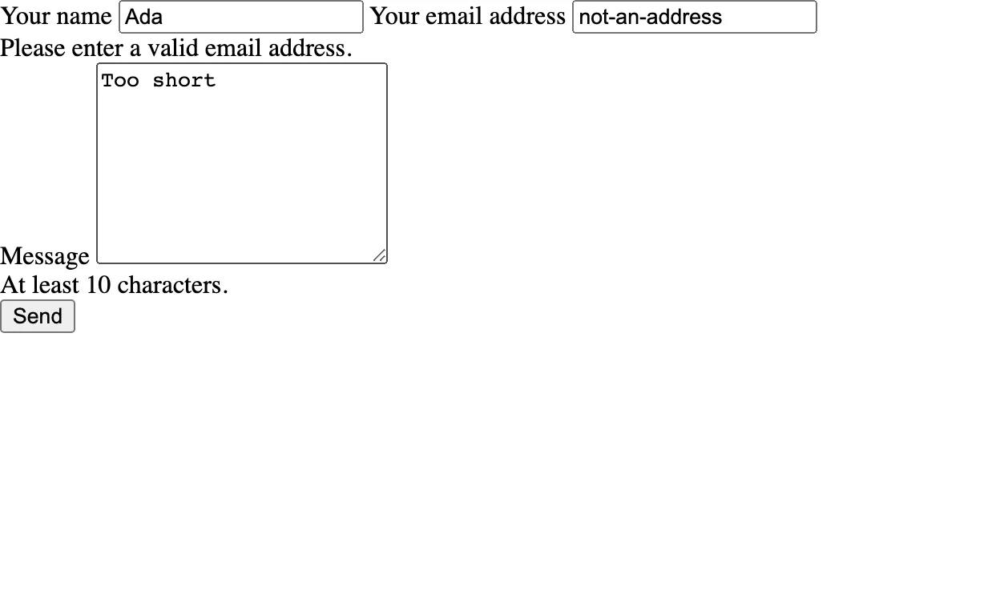
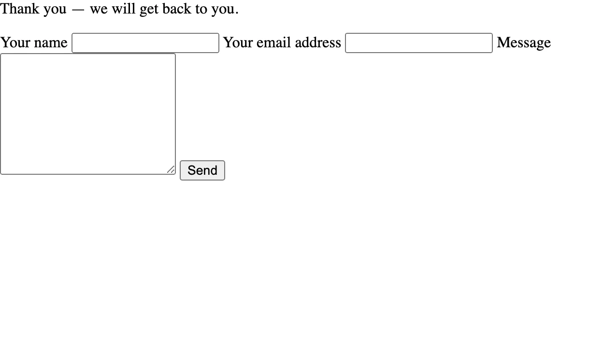

# A contact form

Build a form that shows validation errors beside the submitted values and redirects after a
valid message. You will capture the message in a local outbox so you can inspect the complete
flow without configuring a mail server.

| Result | Packages | Starting point |
|---|---|---|
| A validated message, local mail outbox and success redirect | Starter + `naf/mail` | [Your first application](../first-app.md) |

Choose this scenario when a website needs to accept a message. If you only need to display
pages, start with [the small website](small-website.md). [Compare all scenarios](index.md).

Start from [Your first application](../first-app.md), then install Mail and update Form:

```bash
composer require naf/mail 'naf/form:^0.2.3'
```

The starter already supplies View and Session. It locks Form 0.2.2; version 0.2.3 checks
every state-changing request method and provides `csrf()->token()`, which the template uses. Each titled block is a complete
file; create missing directories and replace the tutorial's corresponding files. If you combine
recipes, merge their routes and service bindings instead of discarding the existing ones.

This local exercise writes messages to `storage/mail/` and shows a thank-you after redirecting.
It works without a mail server and sends nothing externally. For automated tests that only
need an in-memory list, see [the dummy transport](../mail.md#testing-without-a-mail-server). [Handling a POST
request](post-requests.md) explains the underlying request flow.

## A local mail outbox

Start by choosing where messages go. This application-owned transport writes each message to
a local file instead of using PHP's default mail delivery.

```bash
mkdir -p app/Mail storage/mail
```

```php title="app/Mail/FileTransport.php"
<?php

namespace App\Mail;

use Naf\Mail\Core\TransportInterface;
use Naf\Mail\Models\Mail;

final class FileTransport implements TransportInterface
{
    public function sendMail(Mail $mail): bool
    {
        $data = json_encode([
            'from' => $mail->getFrom(), 'to' => $mail->getRecipients(),
            'replyTo' => $mail->getReplyTo(), 'subject' => $mail->getSubject(),
            'content' => $mail->getContent(), 'isHtml' => $mail->isHtml(),
        ], JSON_PRETTY_PRINT | JSON_THROW_ON_ERROR);
        $file = BASE_PATH . '/storage/mail/' . bin2hex(random_bytes(12)) . '.json';
        return file_put_contents($file, $data, LOCK_EX) !== false;
    }
}
```

Select it in the `mail:transport` setting. This replaces the tutorial's empty configuration;
merge the `mail` key if your configuration already has other settings:

```php title="app/config.php"
<?php

declare(strict_types=1);

use App\Mail\FileTransport;

return [
    'mail' => ['transport' => FileTransport::class],
];
```

The shared `mailer()` now builds `FileTransport` through the container. Keep the
tutorial's `bootstrap.php` unchanged.

## The routes

The outbox is configured. Next, register a GET action to display the form and a POST action
to handle its submission. Keep the home and greeting routes from the first application;
the highlighted lines are new.

```php title="app/routes.php" hl_lines="3 8 9"
<?php
use App\Controllers\HomeController;
use App\Controllers\ContactController;
use function Naf\route;

route()->add('GET', '/', [HomeController::class, 'index'], 'home');
route()->add('GET', '/hello/{name}', [HomeController::class, 'hello'], 'hello');
route()->add('GET',  '/contact', [ContactController::class, 'show'],   'contact');
route()->add('POST', '/contact', [ContactController::class, 'submit'], 'contact.submit');
```

## The controller

Add the two actions referenced by the routes. Validation happens before a message is written;
on failure, the controller returns the same form with the submitted values and errors.

```php title="app/Controllers/ContactController.php"
<?php

namespace App\Controllers;

use Psr\Http\Message\ResponseInterface;
use function Naf\Form\validator;
use function Naf\Mail\mail;
use function Naf\Mail\mailer;
use function Naf\Session\session;
use function Naf\View\render;
use function Naf\{abort, param};
use function Naf\redirect;
use function Naf\route;

final class ContactController
{
    public function show(): ResponseInterface
    {
        return render('contact', ['check' => validator()]);
    }

    public function submit(): ResponseInterface
    {
        foreach (['name', 'email', 'message'] as $field) {
            if (!is_string(param()->get($field, ''))) {
                abort(400, 'Form fields must be strings.');
            }
        }

        $check = validator()->validate(param()->all(), [
            'name'    => 'required|max:80',
            'email'   => 'required|email',
            'message' => 'required|min:10|max:2000',
        ]);

        if (!$check->isValid()) {
            // Back to the form. What was typed is still in the request, so
            // memory() finds it — see the template below.
            return render('contact', ['check' => $check])->withStatus(422);
        }

        $mail = mail()
            ->setFrom('website@example.com')
            ->addTo('office@example.com')
            ->setReplyTo(param()->get('email'))
            ->setSubject('New contact message')
            ->setContent('From: ' . param()->get('name') . "\n\n" . param()->get('message'), false);

        if (!mailer()->send($mail)) {
            throw new \RuntimeException('Could not write the local mail preview.');
        }

        session()->flash('notice', 'Thank you — we will get back to you.');

        return redirect(route('contact'));
    }
}
```

The controller makes three choices that also matter when you configure real delivery.

**Use an address you control in `setFrom()`.** Configure it to match your delivery system's
sender requirements. Put the visitor's address in `setReplyTo()` so replies reach that visitor
without claiming that your application sends on their behalf.

**The body is plain text.** Passing `false` to `setContent()` avoids interpreting submitted
text as HTML. The subject is fixed; visitor text belongs in the body.

**The success path redirects.** The thank-you lives in a flash message, which survives exactly
one request — the redirect's — and is gone on the next reload.

## The template

The controller passes a validator to the template on both GET and POST. Use it to display
field errors, and escape submitted values when placing them back into the form.

```html+php title="app/views/contact.phtml"
<?php
use function Naf\Form\csrf;
use function Naf\Form\error;
use function Naf\Form\error_class;
use function Naf\Form\memory;
use function Naf\View\s;
use function Naf\Session\session;
use function Naf\route;
?>

<?php if ($notice = session()->getFlash('notice')): ?>
    <p class="notice"><?= s($notice) ?></p>
<?php endif; ?>

<form action="<?= route('contact') ?>" method="post">

    <label for="name">Your name</label>
    <input id="name" type="text" name="name"
           class="<?= error_class('name', $check) ?>"
           value="<?= s(memory('name') ?? '') ?>">
    <?= error('name', $check) ?>

    <label for="email">Your email address</label>
    <input id="email" type="email" name="email"
           class="<?= error_class('email', $check) ?>"
           value="<?= s(memory('email') ?? '') ?>">
    <?= error('email', $check) ?>

    <label for="message">Message</label>
    <textarea id="message" name="message" rows="8"
              class="<?= error_class('message', $check) ?>"><?= s(memory('message') ?? '') ?></textarea>
    <?= error('message', $check) ?>

    <input type="hidden" name="_csrf" value="<?= s(csrf()->token()) ?>">

    <button type="submit">Send</button>
</form>
```

`memory()` reads the current request, so the visitor can correct a field without retyping
the whole message. `error()` displays a field's validation message, and `error_class()` returns
a class name for styling. Both use the validator passed by the controller; on the initial
GET, that validator has no errors to display.

## Try it

```bash
composer dump-autoload
php -S 127.0.0.1:8000 -t public
```

Open **http://127.0.0.1:8000/contact**. Invalid fields return HTTP 422 with errors and the
submitted values. A valid name, email and message of at least ten characters redirects back
with a thank-you.

=== "Invalid input (422)"

    { .screenshot loading=lazy }

=== "After a valid message"

    { .screenshot loading=lazy }

The recipe adds no stylesheet, so the browser's default form styles are expected. Inspect the new JSON file in `storage/mail/`; it contains the message.
Reloading removes the flash message. A POST without a valid `_csrf` token returns 400.

## If the result is different

| What you see | What to check |
|---|---|
| The form returns 422 | Correct the fields with errors; the submitted text stays available for that response |
| Submitting an old form returns 400 | Reload `/contact` for a fresh CSRF token, retain the session cookie and submit the form again |
| A valid submission returns 500 | Inspect the PHP terminal and `logs/app.log` if it exists; check that `storage/mail/` exists and is writable by PHP |
| A thank-you appears, but no email arrives | This exercise captures mail locally; inspect the JSON file in `storage/mail/` |

If you copied only part of the recipe, check that the routes, controller, template and the
`mail:transport` setting all come from this example. [Troubleshooting](../troubleshooting.md#forms-and-sessions)
has further checks for tokens, cookies and form values.

## Continue building

The local outbox is application code for development, not a built-in NAF transport. To deliver
real mail, select a configured transport in `mail:transport` as described in
[Sending mail](../mail.md#switching-to-real-delivery) and use sender/recipient addresses you control. Check the boolean result before reporting
success. Use a [queue](../queues.md) when delivery should happen outside the request.

See [Testing applications](../testing.md) to automate verification and [Deployment](../deployment.md) for production setup.
