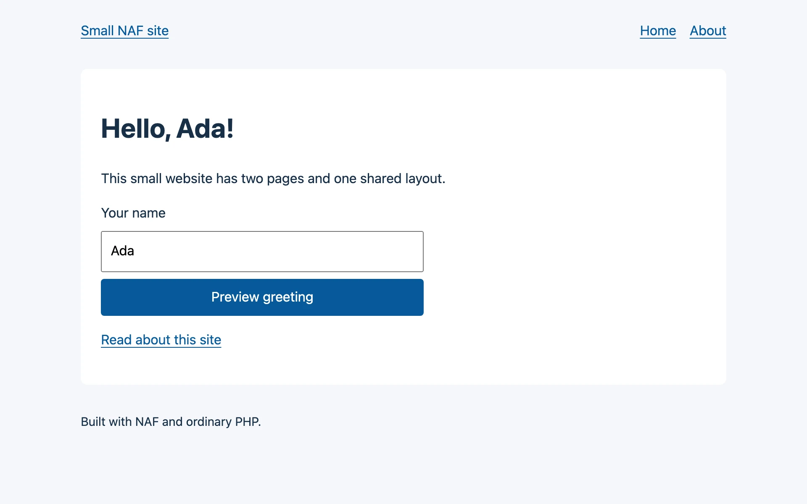

# A small website

Build a two-page public website with a shared layout, a stylesheet and a greeting preview.
The preview reads a name from the query string and escapes it before displaying it. It does
not save data, sign in users or send messages.

| Result | Packages | Starting point |
|---|---|---|
| Home page, About page and a read-only greeting | `naf/framework` + `naf/view` | An empty directory, PHP 8.3+ and Composer |

For a website that accepts submissions, the [contact form](contact-form.md) provides a separate
starter-based project. For other combinations, see [the scenario list](index.md).

## 1. Create the project

Run these commands from the directory in which you keep your projects:

```bash
mkdir naf-site
cd naf-site
mkdir -p app/Controllers app/views/layouts public/css
```

Every titled block below is a complete file, relative to `naf-site/`. This tutorial installs
only the core and view package; it does not require the application starter.

```json title="composer.json"
{
    "name": "example/naf-site",
    "description": "A small public NAF website",
    "type": "project",
    "license": "MIT",
    "require": {
        "php": ">=8.3",
        "naf/framework": "^0.2.8",
        "naf/view": "^0.2.2"
    },
    "autoload": { "psr-4": { "App\\": "app/" } }
}
```

```gitignore title=".gitignore"
/vendor/
/.env
/.env.local
/logs/
/storage/
```

```ini title=".env"
APP_ENV=dev
```

```bash
composer install
```

Commit `composer.json` and the generated `composer.lock` when you put the project in Git.
Keep the environment files private. The view package is discovered automatically after
installation; no plugin registration file is needed.

## 2. Bootstrap and register routes

The dependencies are installed. Next, add the web entry point and bootstrap so a request can
reach NAF, then register the two page routes. Their controller and templates follow below.

```php title="public/index.php"
<?php

declare(strict_types=1);

require dirname(__DIR__) . '/bootstrap.php';
```

```php title="bootstrap.php"
<?php

declare(strict_types=1);

use Naf\Core\Event;
use Psr\Http\Message\ResponseInterface;

use function Naf\app;
use function Naf\event;

define('BASE_PATH', __DIR__);

require __DIR__ . '/vendor/autoload.php';

event()->listen(Event::RESPONSE_HEADER, static function (ResponseInterface $response): ResponseInterface {
    return $response
        ->withHeader('X-Content-Type-Options', 'nosniff')
        ->withHeader('Referrer-Policy', 'strict-origin-when-cross-origin')
        ->withHeader(
            'Content-Security-Policy',
            "default-src 'none'; style-src 'self'; base-uri 'none'; form-action 'self'; frame-ancestors 'none'",
        );
});

app()->run();
```

The header listener applies to responses emitted by NAF. This content security policy fits
these pages: a local stylesheet, no JavaScript and no embedded content. Update the policy
deliberately when adding images, scripts or external resources. The web server serves static
files separately; configure their headers there if needed.

```php title="app/routes.php"
<?php

declare(strict_types=1);

use App\Controllers\PageController;

use function Naf\route;

route()->add('GET', '/', [PageController::class, 'home'], 'home');
route()->add('GET', '/about', [PageController::class, 'about'], 'about');
```

Route names let the templates generate links without repeating their paths. Loading this
file registers actions; NAF constructs the controller when a matching request arrives.

## 3. Read input and return a page

The routes refer to `PageController`. Add that class now: it reads the optional greeting
name, checks the input and chooses the template for each page.

```php title="app/Controllers/PageController.php"
<?php

declare(strict_types=1);

namespace App\Controllers;

use Psr\Http\Message\ResponseInterface;

use function Naf\abort;
use function Naf\request;
use function Naf\View\render;

final class PageController
{
    public function home(): ResponseInterface
    {
        $name = request()->getQueryParams()['name'] ?? 'visitor';

        if (!is_string($name) || strlen($name) > 80 || preg_match('//u', $name) !== 1) {
            abort(400, 'Use a UTF-8 name of at most 80 bytes.');
        }

        $name = trim($name);

        return render('home', [
            'title' => 'Home',
            'name'  => $name === '' ? 'visitor' : $name,
        ]);
    }

    public function about(): ResponseInterface
    {
        return render('about', ['title' => 'About']);
    }
}
```

The controller accepts only text, bounds its byte length and rejects invalid UTF-8. A string
default alone would not reject `?name[]=Ada`. The name remains plain text here; the template
escapes it for HTML output. `render()` returns the response, so the action does not emit
headers or call `exit`.

## 4. Share the HTML layout

Both actions now refer to templates. Create the shared document first, then fill its `content`
block from each page. This keeps navigation and page structure in one place.

```php title="app/views/layouts/main.phtml"
<?php

declare(strict_types=1);

use function Naf\route;
use function Naf\View\s;
?>
<!DOCTYPE html>
<html lang="en">
<head>
    <meta charset="utf-8">
    <meta name="viewport" content="width=device-width, initial-scale=1">
    <title><?= s($title) ?> · Small NAF site</title>
    <link rel="stylesheet" href="/css/site.css">
</head>
<body>
    <header>
        <a href="<?= s(route('home')) ?>">Small NAF site</a>
        <nav aria-label="Main navigation">
            <a href="<?= s(route('home')) ?>">Home</a>
            <a href="<?= s(route('about')) ?>">About</a>
        </nav>
    </header>
    <main>
        <?= $this->renderBlock('content') ?>
    </main>
    <footer>Built with NAF and ordinary PHP.</footer>
</body>
</html>
```

```php title="app/views/home.phtml"
<?php

declare(strict_types=1);

use function Naf\route;
use function Naf\View\s;

$this->setLayout('layouts.main');
$this->block('content');
?>
<h1>Hello, <?= s($name) ?>!</h1>
<p>This small website has two pages and one shared layout.</p>
<form method="get" action="<?= s(route('home')) ?>">
    <label for="name">Your name</label>
    <input id="name" name="name" value="<?= s($name) ?>" maxlength="80">
    <button type="submit">Preview greeting</button>
</form>
<p><a href="<?= s(route('about')) ?>">Read about this site</a></p>
<?php $this->endblock('content'); ?>
```

```php title="app/views/about.phtml"
<?php

declare(strict_types=1);

use function Naf\route;
use function Naf\View\s;

$this->setLayout('layouts.main');
$this->block('content');
?>
<h1>About this site</h1>
<p>Page content lives in templates. The controller supplies the values to display.</p>
<p><a href="<?= s(route('home')) ?>">Back to the home page</a></p>
<?php $this->endblock('content'); ?>
```

Use `s()` for dynamic HTML text and quoted attribute values. The layout renders the content
block directly because it contains HTML produced by these trusted templates; dynamic values
inside that block have already been escaped. `s()` does not sanitize JavaScript or arbitrary
URLs. Here, link targets come from named application routes.

The form uses GET because previewing a greeting changes no state. No session or CSRF token
is needed for this operation. Use the [POST guide](post-requests.md) when adding a submission
that changes state.

```css title="public/css/site.css"
:root { font-family: system-ui, sans-serif; color: #183048; background: #f5f7fa; }
body { max-width: 48rem; margin: 0 auto; padding: 1.5rem; line-height: 1.6; }
header, nav { display: flex; gap: 1rem; flex-wrap: wrap; }
header { justify-content: space-between; }
main { margin: 2rem 0; padding: 1.5rem; background: white; border-radius: .5rem; }
a { color: #075a9c; text-underline-offset: .2em; }
form { display: grid; gap: .5rem; max-width: 24rem; }
input, button { font: inherit; padding: .6rem; }
input { min-width: 0; }
button { color: white; background: #075a9c; border: 0; border-radius: .25rem; cursor: pointer; }
footer { font-size: .9rem; }
```

## 5. Run and check the result

All application files are now in place. From the project root:

```bash
composer dump-autoload
php -S 127.0.0.1:8000 -t public
```

Open **http://127.0.0.1:8000/**. You should see “Hello, visitor!”, the greeting form and an
About link. Submit the name Ada; the URL becomes `/?name=Ada` and the heading says
“Hello, Ada!”. Both pages use the same navigation and stylesheet.

{ .screenshot loading=lazy }

Run these checks in another terminal:

```bash
curl -i 'http://127.0.0.1:8000/?name=Ada'
curl -i 'http://127.0.0.1:8000/?name=%3Cscript%3Ealert(1)%3C%2Fscript%3E'
curl -i 'http://127.0.0.1:8000/?name%5B%5D=Ada'
curl -i http://127.0.0.1:8000/about
curl -i http://127.0.0.1:8000/missing
```

| Request | Expected result |
|---|---|
| `GET /` or `GET /?name=Ada` | 200, an HTML page and the response headers from bootstrap |
| A name containing `<script>` | 200; HTML source contains `&lt;script&gt;`, displayed as text |
| `GET /?name[]=Ada`, invalid UTF-8 or a name over 80 bytes | 400 |
| `GET /about` | 200, About page with the shared layout |
| `GET /missing` | 404 |

## If the result is different

| What you see | What to check |
|---|---|
| A welcome page from another project | Stop the earlier server and start this one from `naf-site/` with `-t public` |
| A class-not-found or missing-view error | Check the file paths and case shown above; run `composer dump-autoload` after correcting a class path |
| The page has no styling | Check that `/css/site.css` returns 200 and that the file is under `public/css/`; the policy permits this local stylesheet |
| The greeting returns 400 | Try `/?name=Ada`; arrays, invalid UTF-8 and names over 80 bytes are intentionally rejected |

For a 500 response, inspect the PHP server terminal and `logs/app.log` if it exists. Keep
`APP_ENV=dev` for local diagnosis; [Troubleshooting](../troubleshooting.md#routing-and-bootstrap)
explains how to separate routing, autoload and template problems.

## Continue building

NAF handles routing and response emission. Your controller owns input rules, and your
templates own escaping. Keep additional page content in templates; move reusable business
rules into constructor-injected services when you add them.

For deployment, use HTTPS, serve only `public/` and set **`APP_ENV=prod`** so unexpected
errors do not expose development details. Follow [Deployment](../deployment.md) and
[Testing applications](../testing.md). To return data instead of HTML, try the
[JSON API without a database](simple-json-api.md).
