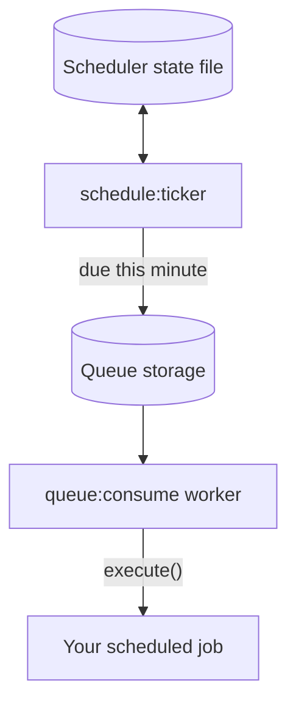

# Scheduled jobs

`naf/schedule` checks cron expressions and enqueues due jobs. A queue worker executes them.
The package installs Queue and CLI. Run a ticker and worker with the same application
configuration and queue storage.

## A scheduled job

Start from [Your first application](first-app.md), install Schedule, and create the following
job. It writes to worker output every minute so setup can be verified without external effects.

```php title="app/Jobs/RecordHeartbeat.php"
<?php

declare(strict_types=1);

namespace App\Jobs;

use Naf\CLI\Core\Output;
use Naf\Queue\Core\QueueJobInterface;
use Naf\Schedule\Core\ScheduledJobInterface;

final class RecordHeartbeat implements QueueJobInterface, ScheduledJobInterface
{
    public function __construct(private string $message = 'Scheduled heartbeat executed.') {}

    public function getCronExpression(): string
    {
        return '* * * * *';
    }

    public function execute(Output $output): void
    {
        $output->writeLine($this->message);
    }
}
```

The cron expression uses the PHP process's timezone. For example, `0 3 * * *` runs at 03:00
in that timezone. Configure it consistently across ticker processes.

## Registering it

Create this application registration file. It gives this application its own persistent state
file rather than using the default shared temporary filename:

```php title="app/schedule.php"
<?php

declare(strict_types=1);

use App\Jobs\RecordHeartbeat;
use Naf\Queue\Core\Queue;
use Naf\Schedule\Core\JobRepository;
use Naf\Schedule\Core\Scheduler;
use Naf\Schedule\Support\CronParser;
use function Naf\app;
use function Naf\Schedule\scheduler;

$container = app()->container();
$container->set(Scheduler::class, static fn() => new Scheduler(
    $container->get(Queue::class),
    $container->get(JobRepository::class),
    $container->get(CronParser::class),
    BASE_PATH . '/storage/schedule-state.json',
));
scheduler()->addScheduledJob(RecordHeartbeat::class);
```

Create `storage/` and add this include to root `bootstrap.php`, after Composer autoloading
and before `app()->run()`:

```php-inline
require_once BASE_PATH . '/app/schedule.php';
```

Each scheduled class can be registered once; a second registration replaces the first.
`vendor/bin/naf schedule:list` shows registered jobs and their next occurrence.
`--from="2026-10-12 08:00"` calculates occurrences from another start time, and `--no-sort`
keeps registration order instead of sorting by the next occurrence.

### Passing job data

Replace the final registration in `app/schedule.php` with this fragment to supply data:

```php-inline
scheduler()->addScheduledJob(RecordHeartbeat::class, [
    'message' => 'Scheduled catalog check executed.',
]);
```

The ticker constructs the job with that payload to read its cron expression, then queues
the payload for the worker to construct it again. Here `message` matches the constructor
parameter `$message`; explicit names take precedence over its default. Keep job data
JSON-serializable and validate values before using them. Reserve keys beginning with `_`
for queue metadata.
The worker now prints `Scheduled catalog check executed.`. A second registration of the
same class replaces its payload; it does not create another schedule. Payload values are
not part of the class/expression key used for minute tracking and coalescing.

If a job instead takes the whole array, use a required `array $payload` parameter with
nonempty job data, as in [Queues](queues.md#a-job). An optional
`array $payload = []` uses its default before the container's unmatched-array fallback,
so unrelated keys such as `message` would be ignored. See [constructor parameter resolution](dependency-injection.md).

## Ticker and worker { #two-processes-not-one }

Scheduling needs two processes. The ticker only decides that a job is due and queues it; a
queue worker runs it:



Verify the example from the project root:

```bash
mkdir -p storage
composer dump-autoload
vendor/bin/naf schedule:ticker --once
vendor/bin/naf queue:consume --once
```

Expect the ticker to report a queued `RecordHeartbeat`, then the worker to print
`Scheduled heartbeat executed.` Repeating the ticker within the same recorded minute does
not enqueue that schedule again.

For continuous operation, run both commands under a supervisor:

```bash
vendor/bin/naf schedule:ticker
vendor/bin/naf queue:consume
```

A running ticker without a worker leaves jobs waiting in the queue. Stop and remove the demo
registration when replacing it with application jobs.

## Running the ticker

| Option | Effect |
|---|---|
| `--once` | One scheduling pass, then exit |
| `--max-jobs=N` | Exit after queueing N jobs |
| `--max-runtime=N` | Exit after N seconds |
| `--workers=N` | Start N queue-worker child processes |

Child workers write under `logs/queue/`. The ticker owns them and closes them on exit.
Separate supervised workers allow independent scaling and restarts.

```ini
[program:naf-schedule]
directory=/var/www/my-app
command=php /var/www/my-app/vendor/bin/naf schedule:ticker --max-runtime=3600
autostart=true
autorestart=true
```

Replace the path with the deployed application. Configure a separately supervised worker
unless using `--workers`. See [Deployment](deployment.md#background-processes).

## Missed occurrences { #what-happens-to-a-window-that-was-missed }

The ticker evaluates the current minute; it does not catch up missed occurrences. A daily
03:00 job on a machine unavailable until 03:05 waits until the next scheduled day. For tasks
that must eventually run, persist completion state and check overdue work in application logic.

## Coalescing queued runs { #why-a-backlog-does-not-build-up }

By default, the scheduler adds a deterministic `_job_id` for each class/expression pair.
The file queue uses it as a filename, so later occurrences replace an unconsumed run of that
same schedule. This suits work such as rebuilding the latest cache state.

| Work | Coalescing choice |
|---|---|
| Refresh a snapshot, rebuild a cache or synchronize the latest state | Keep `true` when one pending run can replace an older pending run |
| Process each observed occurrence, such as recording a periodic audit sample | Use `false` and make individual runs identifiable and safe to retry |

Disabling coalescing preserves runs that the ticker actually queues. It does not recover
occurrences missed while the ticker was stopped, or make delivery exactly once.

Add this fragment to `app/config.php` when every occurrence must be queued separately:

```php-inline
'schedule' => ['queue' => ['coalesce' => false]],
```

Coalescing depends on the driver honoring `_job_id`; an append-only driver may not implement
it. It is not a guarantee that side effects execute exactly once.

## Duplicate prevention and state { #not-running-the-same-minute-twice }

The scheduler records the last queued minute under a file lock and replaces its state file
atomically. Tickers coordinate only when they use the same state file and lock on a filesystem
that supports those operations. The default is `sys_get_temp_dir() . '/naf-schedule-state.json'`;
use an application-specific path as in the example and preserve it across restarts.

A failed enqueue is not recorded as complete. A crash after enqueue but before recording can
still duplicate work. Design non-repeatable side effects around durable application identifiers
and idempotency, as with [queue leases](queues.md#the-database-driver-for-more-than-one-machine).

Set `schedule:heartbeat_file` to an application-specific writable path to record ticker
polling. A heartbeat does not prove that jobs completed successfully.

## Configuration

| Key | Type | Default | Effect |
|---|---|---|---|
| `schedule:queue:coalesce` | bool | `true` | Give each class/expression pair one job id, so an unconsumed run is replaced instead of duplicated |
| `schedule:heartbeat_file` | string | — | File the ticker updates with a timestamp on every pass |

The state file location is a constructor argument of `Scheduler`, not a configuration key;
register it as in [Registering it](#registering-it).

## If the result is different

| What you see | What to check |
|---|---|
| The ticker queues the job but nothing runs | A queue worker is running for the default channel |
| The ticker queues nothing | The registration file is included from `bootstrap.php`; the cron expression matches the current minute in the PHP timezone; `schedule:list` shows the job |
| A second `--once` pass in the same minute queues nothing | Expected: the state file records the minute |
| A job runs twice | Two tickers use different state files; point them at the same file |
